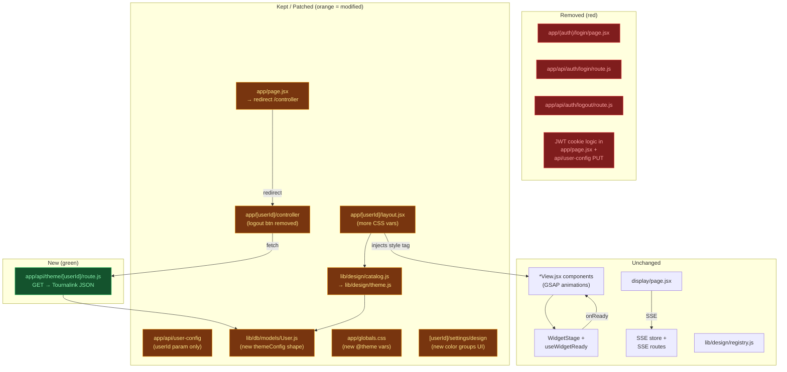

# Plan: Auth Removal + Theme System Upgrade

**Created:** 2026-05-16
**Status:** draft
**Goal:** Strip all login/auth machinery so the platform runs without user accounts, then upgrade the theme system from a flat 5-color-slot model to a Tournalink-style structured color API — giving every widget access to a rich, semantically-named color palette injected via CSS custom properties.

---

## Research Findings

### Animation System (current — keep as-is)

The existing pattern is solid and should not change:

1. Widget page (Server Component) → resolves design bundle → renders View (Client Component)
2. View renders with `opacity-0` on all animated elements (pre-set via GSAP `gsap.set()`)
3. `WidgetStage` wraps everything; `useWidgetReady` scans all `` tags in the subtree
4. Once every `` has fired `load` (or `error` + HIDE flag), `WidgetStage` flips `opacity-100` and fires `onReady`
5. `onReady` sets `stageReady = true`, `useGSAP({ dependencies: [data, stageReady] })` runs the timeline

**Result:** Animation never plays while images are still loading. No progressive-JPEG flashes on stream. This is the correct, production-grade pattern — document it and do not change it.

**One gap:** `gsap.set()` pre-sets and the final `gsap.to()` are both inside `useGSAP`. If `stageReady` flips before GSAP's set runs, elements briefly flash at their natural opacity. The fix (already in the code) is that elements have `opacity-0` as a Tailwind class too — belt-and-suspenders. Keep this convention in all future widget views.

---

### SSR vs CSR for Broadcast Widgets

**Decision: SSR shell + CSR view — the current architecture is correct.**

| Layer                 | Rendering        | Why                                                   |
| --------------------- | ---------------- | ----------------------------------------------------- |
| `[userId]/layout.jsx` | Server Component | Theme CSS vars in HTML before paint — zero FOUC       |
| Widget `page.jsx`     | Server Component | Resolves design bundle key from DB, no client JS cost |
| Widget `*View.jsx`    | Client Component | GSAP, RTK Query, useState, useRef all require client  |
| `display/page.jsx`    | Client Component | SSE listener, iframe re-mount via `key`               |
| `controller/page.jsx` | Client Component | Full interactivity needed                             |

**Why SSR theme injection wins for broadcast:**

- OBS browser source loads the URL, renders to a Chromium frame. The CSS vars are in the first HTML byte — the widget paints with correct colors before any JS executes.
- A Tournalink-style client-side theme fetch would add a round-trip before colors appear, creating a brief unstyled flash that could hit the stream.
- `[userId]/layout.jsx` (Server Component) injecting `<style>:root { ... }</style>` is the fastest possible path for broadcast widgets.

**Tournalink's separate theme API is useful for:**

- Live preview in the settings UI (client-side color updates)
- Future external integrations (tournament software reading widget theme)
- Real-time theme hot-swap without reloading the widget URL

**Recommendation:** Keep SSR injection as the primary mechanism. Add a `GET /api/theme/[userId]` endpoint returning Tournalink-compatible JSON as a secondary mechanism (settings page, API consumers).

---

### How Tournalink Injects Colors

**Request:** `GET https://tournalink.com/widget-api/9/theme`

**Response:**

```json
{
  "success": true,
  "data": {
    "primary": {
      "DEFAULT": "rgb(...)",
      "background": "rgb(...)",
      "border": "rgb(...)",
      "dark": "rgb(...)"
    },
    "secondary": {
      "DEFAULT": "rgb(...)",
      "background": "rgba(...)",
      "border": "rgba(...)",
      "dark": "rgba(...)"
    },
    "status": {
      "alive": "rgba(...)",
      "knocked": "rgba(...)",
      "dead": "rgba(...)"
    },
    "background": "rgb(...)",
    "text": "rgb(...)",
    "gradient": { "start": "#...", "end": "#..." }
  }
}
```

**CSS var mapping (what we will adopt):**

| Token                | CSS Variable             |
| -------------------- | ------------------------ |
| primary.DEFAULT      | --color-primary          |
| primary.background   | --color-primary-bg       |
| primary.border       | --color-primary-border   |
| primary.dark         | --color-primary-dark     |
| secondary.DEFAULT    | --color-secondary        |
| secondary.background | --color-secondary-bg     |
| secondary.border     | --color-secondary-border |
| secondary.dark       | --color-secondary-dark   |
| status.alive         | --color-status-alive     |
| status.knocked       | --color-status-knocked   |
| status.dead          | --color-status-dead      |
| background           | --color-bg               |
| text                 | --color-text             |
| gradient.start       | --color-gradient-start   |
| gradient.end         | --color-gradient-end     |

**Tailwind integration in `globals.css`:**

```css
@theme inline {
  --color-primary: var(--color-primary);
  --color-primary-bg: var(--color-primary-bg);
  /* ... etc */
}
```

This gives every widget access to `bg-primary`, `text-primary`, `border-primary-border`, etc. as Tailwind utilities — exactly how Tournalink widgets use their theme tokens.

---

### Current Auth Surface (everything to delete)

| File                               | Role                                         | Action                                                                              |
| ---------------------------------- | -------------------------------------------- | ----------------------------------------------------------------------------------- |
| `app/(auth)/login/page.jsx`        | Login UI                                     | **DELETE** whole `(auth)` group                                                     |
| `app/api/auth/login/route.js`      | Auth proxy + cookie                          | **DELETE**                                                                          |
| `app/api/auth/logout/route.js`     | Cookie clear                                 | **DELETE**                                                                          |
| `app/page.jsx`                     | Reads JWT, redirects to controller or /login | **REPLACE** — simple redirect to `/controller` (new design)                         |
| `app/[userId]/controller/page.jsx` | Has Logout button                            | **PATCH** — remove logout button only                                               |
| `app/api/user-config/route.js`     | PUT requires JWT; GET allows ?userId         | **PATCH** — remove all JWT cookie checks, use `userId` param only                   |
| `lib/db/models/User.js`            | Stores themeConfig (keep!)                   | **PATCH** — remove email/firstName/lastName if no longer needed, OR keep for future |
| `lib/design/get-user-design.js`    | Reads User.themeConfig.designVariant         | **KEEP** — still needed                                                             |
| `lib/db/mongoose.js`               | DB connection                                | **KEEP** — still needed for themeConfig                                             |

No `middleware.js` exists at the project root (the old plan mentioned it but it was never created) — nothing to remove there.

---

## Context

### Current Theme System

- **Model:** 5 flat color slots (`color1`–`color5`) stored in `User.themeConfig.colors`
- **CSS vars:** `--primary`, `--primary-shade-one`, `--primary-shade-two`, `--custom-yellow`, `--custom-green`
- **Injection:** `[userId]/layout.jsx` (Server Component) calls `buildThemeCss()` → `<style>:root{...}</style>`
- **Settings UI:** `[userId]/settings/design/page.jsx` — color pickers for 5 slots

### Tournalink-Style Theme System (target)

- **Model:** 15 semantic tokens across nested groups (primary, secondary, status, background, text, gradient)
- **CSS vars:** Prefixed `--color-*` namespace to avoid conflicts with existing Tailwind vars
- **Injection:** Same SSR mechanism — layout fetches and injects
- **API:** `GET /api/theme/[userId]` returns Tournalink-compatible JSON

---

## Strategy

### Task 1 — Remove Auth (immediate, clean-up)

Surgical removal of all auth machinery. The routing structure (`[userId]` segment) stays — userId is still used to scope theme config and SSE state per operator.

### Task 2 — Upgrade Theme Color Model

Replace the flat 5-slot model with the Tournalink-style nested structure. Update:

- `User.js` Mongoose schema
- `lib/design/catalog.js` (rename to `lib/design/theme.js`, add defaults for all 15 tokens)
- `[userId]/layout.jsx` — inject all new CSS vars
- `globals.css` — register new `@theme inline` vars
- `settings/design/page.jsx` — new UI for all color groups

### Task 3 — Add Theme API Endpoint

`GET /api/theme/[userId]` → returns Tournalink-format JSON. Consumed by the settings live preview and available for external tools.

---

## Tasks

1. **remove-auth** — Delete login page, login/logout routes, JWT cookie logic from user-config and root page; strip logout button from controller
2. **upgrade-theme-model** — Replace flat 5-slot color model with Tournalink-style 15-token nested model in DB schema, catalog, layout, globals.css, and settings UI
3. **add-theme-api** — Add `GET /api/theme/[userId]` returning Tournalink-compatible JSON; wire settings page live preview to it

---

## Risks

- `userId` is still hardcoded in localStorage keys (`tournamentId_${userId}`) — without auth, operators must still know/configure their userId. Consider replacing with a fixed string like `"operator"` post-auth-removal if you go fully single-tenant.
- Changing the CSS variable names (from `--primary` to `--color-primary`) will break all existing widget components that use `bg-primary`, `text-primary-shade-one`, etc. — this must be done in one atomic commit and all widget views updated simultaneously.
- MongoDB schema change from `{ color1, color2, ... }` to `{ primary: { DEFAULT, background, border, dark }, ... }` — existing stored data must be migrated or the old data gracefully ignored (fall back to defaults).

---

## Architecture Diagram


