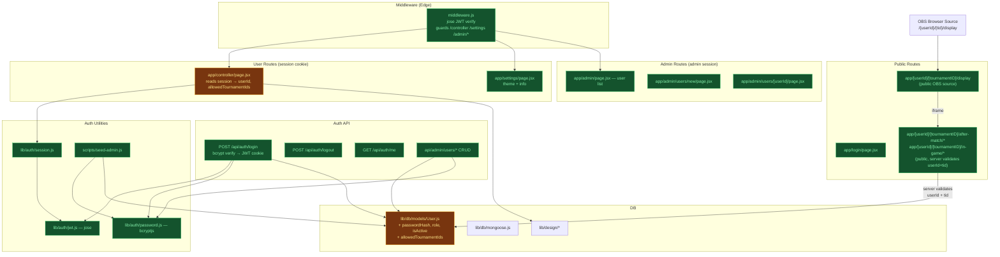

# Plan: Auth System — Admin + Widget User Management
**Created:** 2026-05-16
**Status:** draft
**Goal:** Build a complete self-contained JWT auth system. Admin (seeded via script) manages widget customers — creates users with a custom prefixed UUID, assigns allowed tournament IDs, manages theme. Widget URLs include both userId and tournamentID making them unique and self-authenticating (server validates the combination). Only controller, settings, and admin require a session cookie. Display and widget pages are public — OBS just uses the full URL.

---

## Context

### What exists
- **DB:** MongoDB via Mongoose, `WIDGET_CONTROL` DB, `lib/db/mongoose.js`
- **User model:** `lib/db/models/User.js` — currently `{ _id: String, email, firstName, lastName, themeConfig }`. Needs full replacement.
- **Design system:** `lib/design/catalog.js`, `lib/design/get-user-design.js`, `lib/design/registry.js`
- **Flat routing (current):** `/controller`, `/[tournamentID]/display`, `/[tournamentID]/after-match/*` etc. — all open, no userId in widget URLs
- **No auth:** All routes open. Old `proxy.js` deleted.

### Packages needed
- `bcryptjs` — password hashing (pure JS, no native bindings, Node.js only)
- `jose` — JWT sign/verify (Edge Runtime compatible — required for middleware)

---

## Data Model

### User (rebuilt)
```js
{
  _id:                  String,   // "effinity-{nanoid(16)}" e.g. "effinity-k2f9xm3q8vbz4e1a"
  name:                 String,
  email:                String,   // unique, used to log in
  passwordHash:         String,   // bcrypt hash
  role:                 String,   // "admin" | "user"
  isActive:             Boolean,  // admin can disable without deleting
  allowedTournamentIds: [String], // which tournamentIDs this user's widgets can serve
  themeConfig: {
    designVariant:      String,
    colors: { color1, color2, color3, color4, color5 }
  },
  createdAt, updatedAt
}
```

### Seed admin credentials
| Field | Value |
|---|---|
| ID | `effinity-admin` |
| Email | `adm@efn.io` |
| Password | `Efn!2k26Xq` |
| Role | `admin` |

---

## Routing

```
PUBLIC (no session needed):
  /login                                         → login page
  /[userId]/[tournamentID]/display               → OBS browser source
  /[userId]/[tournamentID]/after-match/*         → widget pages (server-validates userId+tid combo)
  /[userId]/[tournamentID]/in-game/*             → widget pages
  /[userId]/[tournamentID]/widgets               → widget links index

PROTECTED (valid session — any role):
  /controller                                    → user's scoped controller
  /settings                                      → user settings (theme, info)

PROTECTED (admin role only):
  /admin                                         → admin dashboard (user list)
  /admin/users/new                               → create user
  /admin/users/[userId]                          → edit user
```

### How widget page auth works (no session needed)
1. Widget URLs contain both `userId` and `tournamentID`
2. `userId` is `effinity-{16chars}` — practically unguessable
3. Server Component fetches user from DB, checks `tournamentID ∈ allowedTournamentIds`
4. If not authorised → 404 (no data exposed, no redirect loop)
5. OBS sets browser source to `/{userId}/{tournamentID}/display` — works without any session

### Display page update
- Currently: `/{tournamentID}/display` (flat)
- New: `/{userId}/{tournamentID}/display` (includes userId)
- Controller generates display URL as `${origin}/${userId}/${tid}/display`
- All widget iframe URLs become `/${userId}/${tid}/after-match/score` etc.

---

## Auth implementation — JWT with jose

**Why JWT + jose, not NextAuth:**
- NextAuth is built for OAuth providers (Google, GitHub). Our use case is simple username/password with one custom role.
- `jose` works in Edge Runtime (middleware) — `jsonwebtoken` does not.
- Full control over token shape, expiry, cookie settings.
- No extra abstraction layer, no session DB table needed.

**Flow:**
1. `POST /api/auth/login` → bcrypt verify password → sign JWT with `jose` → set httpOnly cookie
2. `middleware.js` → read cookie → verify JWT with `jose` → allow/redirect
3. Server Components → call `getSession()` from `lib/auth/session.js` → reads same cookie

**JWT payload:**
```js
{ userId, role, iat, exp }   // exp: 72h
```

---

## Strategy

### Task 1 — Foundation
Rebuild User model. Install `bcryptjs` + `jose`. Write `lib/auth/jwt.js`, `lib/auth/password.js`, `lib/auth/session.js`. Write `scripts/seed-admin.js`. Add `JWT_SECRET` to `.env`.

### Task 2 — Middleware + Auth API routes
`middleware.js` guards `/controller`, `/settings`, `/admin/*`. Public routes pass through. API: `POST /api/auth/login`, `POST /api/auth/logout`, `GET /api/auth/me`.

### Task 3 — Login UI
`/login/page.jsx` — email + password. On success: admin → `/admin`, user → `/controller`.

### Task 4 — Admin Panel
`/admin/page.jsx` user list. `/admin/users/new` create form (generates `effinity-{id}`). `/admin/users/[userId]` edit all fields. API: `/api/admin/users/*` full CRUD.

### Task 5 — Restore userId routing + wire controller + settings
Move widget routes back to `/[userId]/[tournamentID]/...`. Add server-side tournamentID validation in widget pages. Update controller to read session for userId + allowedTournamentIds. Build `/settings` page (theme pickers, info). Wire `[userId]/layout.jsx` back to inject theme from DB.

---

## Tasks

1. **foundation** — User model + packages + auth utils (jwt, password, session) + seed script
2. **auth-middleware-routes** — middleware.js + login/logout/me API routes
3. **login-ui** — /login page
4. **admin-panel** — admin dashboard + user management UI + API routes
5. **restore-routing-controller-settings** — restore /[userId]/[tournamentID] routing, server-side auth in widget pages, scoped controller, /settings page, theme injection

---

## Risks

- **Routing conflict:** `[userId]` and `[tournamentID]` are both dynamic — Next.js will handle `/effinity-abc/123xyz/display` fine since the first segment always has the `effinity-` prefix. No conflict with `/controller` or `/admin` (those are static segments).
- **Old flat widget routes:** `app/[tournamentID]/*` currently exists. Must be replaced by `app/[userId]/[tournamentID]/*`. The old `[tournamentID]` folder will conflict if left in place.
- **OBS URL change:** Operators must update OBS browser source to the new URL format. Breaking change — expected.
- **DB migration:** Old User documents (`_id` as ObjectId string) must be dropped before seeding new format.
- **Edge Runtime:** `middleware.js` uses only `jose` (Edge-safe). All bcrypt work stays in `/api/*` routes (Node.js runtime).
- **Last admin guard:** API must refuse deletion of the last admin account.

---

## Architecture Diagram


