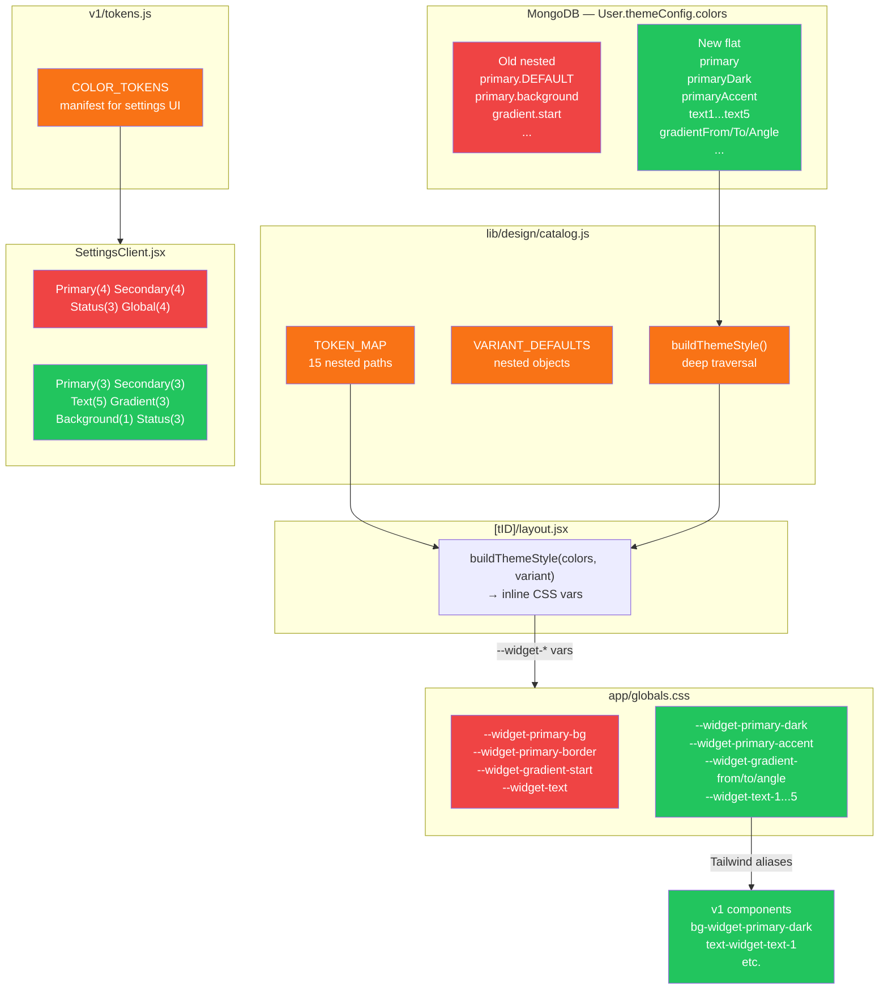

# Plan: Color Token System Simplification

**Created:** 2026-05-19
**Status:** awaiting-approval

---

## Goal

Replace the current 15-token nested color schema with a cleaner flat 18-token system. Simpler mental model, better fit for broadcast widget design, gradient angle support, and flexible multi-slot text colors.

---

## Context: Current vs Proposed

### Current system (nested, 15 tokens)

```
primary.DEFAULT        primary.background     primary.border     primary.dark
secondary.DEFAULT      secondary.background   secondary.border   secondary.dark
status.alive           status.knocked         status.dead
background             text
gradient.start         gradient.end
```

Stored in MongoDB as deeply nested objects. Requires `merge()` deep traversal. Hard to reason about — "primary.background" vs "primary.dark" vs "primary.border" is ambiguous.

### New system (flat, 18 tokens)

```
primary          primaryDark       primaryAccent
secondary        secondaryDark     secondaryAccent
text1            text2             text3            text4    text5
bg
gradientFrom     gradientTo        gradientAngle
statusAlive      statusKnocked     statusDead
```

Stored as a flat object. Every key is a direct top-level field. No nesting.

### Token intent mapping

| New token         | What it's for                        | Default               |
| ----------------- | ------------------------------------ | --------------------- |
| `primary`         | Main brand color                     | `#a54e26`             |
| `primaryDark`     | Darker shade of primary              | `#7a3a1c`             |
| `primaryAccent`   | Highlight/accent of primary          | `#c45e30`             |
| `secondary`       | Second brand color                   | `#008e88`             |
| `secondaryDark`   | Darker shade of secondary            | `#006e69`             |
| `secondaryAccent` | Highlight/accent of secondary        | `#00a89f`             |
| `text1`           | Main text (default: light)           | `#f5f5f5`             |
| `text2`           | Secondary text (default: near-black) | `#1a1a1a`             |
| `text3`           | Custom text 3                        | `#f5f5f5`             |
| `text4`           | Custom text 4                        | `#a0a0a0`             |
| `text5`           | Custom text 5                        | `#ffffff`             |
| `bg`              | Widget background                    | `#0d0d0d`             |
| `gradientFrom`    | Gradient start color                 | `#a54e26`             |
| `gradientTo`      | Gradient end color                   | `#c45e30`             |
| `gradientAngle`   | Gradient direction (degrees)         | `135`                 |
| `statusAlive`     | Player alive state                   | `rgba(255,255,255,1)` |
| `statusKnocked`   | Player knocked state                 | `rgba(244,63,94,1)`   |
| `statusDead`      | Player dead state                    | `rgba(0,0,0,0.5)`     |

> ⚠️ Status tokens kept — required by the live-ranking in-game widget (team member alive/knocked/dead state). If you don't need them in v1 broadcast widgets, they stay in the system but can just be ignored.

### CSS vars → Tailwind classes (new names)

| CSS var                           | Tailwind bg class            | Tailwind text class            |
| --------------------------------- | ---------------------------- | ------------------------------ |
| `--widget-primary`                | `bg-widget-primary`          | `text-widget-primary`          |
| `--widget-primary-dark`           | `bg-widget-primary-dark`     | `text-widget-primary-dark`     |
| `--widget-primary-accent`         | `bg-widget-primary-accent`   | `text-widget-primary-accent`   |
| `--widget-secondary`              | `bg-widget-secondary`        | `text-widget-secondary`        |
| `--widget-secondary-dark`         | `bg-widget-secondary-dark`   | `text-widget-secondary-dark`   |
| `--widget-secondary-accent`       | `bg-widget-secondary-accent` | `text-widget-secondary-accent` |
| `--widget-text-1`                 | —                            | `text-widget-text-1`           |
| `--widget-text-2`                 | —                            | `text-widget-text-2`           |
| `--widget-text-3`                 | —                            | `text-widget-text-3`           |
| `--widget-text-4`                 | —                            | `text-widget-text-4`           |
| `--widget-text-5`                 | —                            | `text-widget-text-5`           |
| `--widget-bg`                     | `bg-widget-bg`               | —                              |
| `--widget-status-alive`           | `bg-widget-status-alive`     | —                              |
| `--widget-status-knocked`         | `bg-widget-status-knocked`   | —                              |
| `--widget-status-dead`            | `bg-widget-status-dead`      | —                              |
| `--widget-gradient-from/to/angle` | inline style only            | —                              |

---

## Strategy

- Flat schema → simpler `merge()`, simpler `buildThemeStyle()`, simpler settings UI
- Breaking change to saved color data — existing nested values become stale. App won't crash (falls back to VARIANT_DEFAULTS). Users re-configure once.
- `default` prototype design is unaffected (uses old `bg-primary-*` tokens, separate system)
- All 3 tasks are sequential — schema must land before CSS, CSS before UI

---

## Tasks

| #   | Name                       | Files                                                                  |
| --- | -------------------------- | ---------------------------------------------------------------------- |
| 1   | `color-schema-and-catalog` | `lib/db/models/User.js`, `lib/design/catalog.js`, `types/widgets.d.ts` |
| 2   | `color-css-and-tokens`     | `app/globals.css`, `components/designs/v1/tokens.js`                   |
| 3   | `color-settings-ui`        | `app/settings/_components/SettingsClient.jsx`                          |
| 4   | `color-docs`               | `GUIDE.md`                                                             |

---

## Risks

| Risk                                                                              | Mitigation                                                                                          |
| --------------------------------------------------------------------------------- | --------------------------------------------------------------------------------------------------- |
| Existing saved user colors are in old nested format                               | `merge()` falls back to VARIANT_DEFAULTS for unrecognised keys — no crash, just reverts to defaults |
| `SettingsClient.jsx` theme presets (`PREDEFINED_THEMES`) use old nested structure | Update `catalog.js` presets to new flat structure in Task 1                                         |
| `saveCustomTheme` in SettingsClient reads `c.primary?.DEFAULT` for swatches       | Update to `c.primary` in Task 3                                                                     |
| `gradientAngle` is a number string, not a color — needs a different input type    | Use a plain text `<Input>` with `placeholder="135"` instead of a color picker                       |
| Old `--widget-gradient-start/end` Tailwind aliases removed                        | No component uses them yet (v1 is empty)                                                            |

---

## Architecture Diagram


