# Plan: Design System Wiring + Infrastructure Monitoring

**Created:** 2026-05-17
**Status:** draft
**Goal:** Fix the broken CSS variable injection so new widget designs actually consume user theme colors, establish a clean workflow for integrating the new production design as the default bundle, and build a lightweight API/SSE latency monitoring layer visible from the admin dashboard — with a path to a real observability backend.

---

## Context

### 1. CSS Variable Injection — Currently Broken

The layout at `app/[userId]/[tournamentID]/layout.jsx` injects CSS custom properties via `buildThemeStyle()`:

```
--color-primary, --color-primary-bg, --color-secondary, --color-bg, ...
```

But every existing widget component (in `components/designs/default/` and `components/widgets/`) uses OLD Tailwind utilities:

```
bg-primary           → maps to --primary         (hardcoded dark gray in :root)
bg-primary-shade-one → maps to --primary-shade-one (hardcoded teal in :root)
bg-primary-shade-two → maps to --primary-shade-two (hardcoded dark teal in :root)
```

The user-specific colors sit under `--color-primary` (with `color-` prefix), exposed as `bg-widget-primary` in Tailwind. **None of the existing widgets use `bg-widget-primary`.** So per-user theming has zero visual effect on the current prototype widgets.

**Verdict: Color injection infrastructure is correct. Widgets are wired to the wrong CSS variables. The prototype designs are not worth fixing — they will be replaced.**

### 2. Design Registry — Current State

- `BUNDLE_MAP` in `lib/design/registry.js` only has `"default"` (mythical is commented out)
- Admin panel now has `DesignsPanel` with `isDefault` / `isExclusive` / `active` toggles ✓
- New user creation auto-grants all `isDefault` designs ✓
- Admin can change `isDefault` and `isExclusive` per design from the dashboard ✓

### 3. New Design Integration Path

The user has a full production design ready. It will:

1. Start as `isDefault: true` — every user gets it
2. Later flip to `isExclusive: true` / `isDefault: false` — manually granted only

Steps: create the component bundle folder → register in `BUNDLE_MAP` → seed to DB → set `isDefault: true`.

### 4. Figma MCP

**No Figma MCP is available in this environment.** However I can work with:

- Figma REST API (read-only, requires a Personal Access Token from you)
- Figma file exports: CSS tokens, JSON design tokens, SVG assets
- You share the Figma link → I fetch via API → extract colors, typography, spacing

### 5. Monitoring — Current State

Zero instrumentation. No timing data anywhere. The SSE `broadcast()` call is synchronous in-process — latency is negligible server-side, but the full round-trip (POST → broadcast → SSE delivery → iframe load) is invisible.

---

## Strategy

### Design System

- **Don't patch the old prototype widgets.** They will be deleted when the real design is ready.
- **Define the contract:** new design components MUST use `bg-widget-primary`, `text-widget-text`, `bg-widget-secondary`, etc. (the Tailwind aliases that read from `--color-*`).
- **Create the new bundle** under `components/designs/<new-key>/index.js`, register it in `BUNDLE_MAP`, seed it, flip `isDefault: true` in the admin panel.

### Monitoring

Two-layer approach:

- **Layer 1 (immediate):** Custom Next.js instrumentation middleware — measures every API route duration, logs structured JSON. An in-memory ring buffer (last 1000 requests) feeds a `/api/admin/metrics` endpoint. Admin dashboard shows a live table grouped by route.
- **Layer 2 (production):** Plug into [Axiom](https://axiom.co) (free 30-day retention, generous free tier) or BetterStack — ship logs via HTTP. Gives you full-text search, grouping, percentiles, dashboards without self-hosting Grafana.

---

## Tasks

1. **css-variable-contract** — Document and enforce the `bg-widget-*` Tailwind token contract that new designs must follow; add a check to the design index type
2. **new-design-bundle** — Scaffold the new design bundle folder structure, wire into `BUNDLE_MAP` and DB, set as default from admin panel
3. **monitoring-layer-1** — Instrument Next.js with a custom timing middleware; build in-memory metrics store; add `/api/admin/metrics`; add metrics table to admin dashboard
4. **monitoring-layer-2** — Ship structured logs to Axiom (or BetterStack); create dashboard queries for p50/p95 by route, SSE command latency, grouped views

---

## Risks

- **New design bundle size:** each bundle is a dynamic import — keep components tree-shakeable; don't import the whole bundle in a shared file
- **In-memory metrics:** lost on server restart / serverless cold start. Layer 1 is for dev/staging visibility only. Layer 2 is the durable store.
- **`--color-primary` vs `--primary` naming collision:** Tailwind's `@theme inline` block registers `--color-primary` as the alias for `--primary` (the shadcn oklch value). This WILL conflict with our widget token `--color-primary`. Need to rename one of them. Widget tokens should move to `--widget-primary` (no `color-` prefix) to avoid the clash.
- **Figma token import:** Figma's REST API requires a PAT. Colors in Figma use hex/rgba — need mapping to our token structure.

---

## Architecture Diagram

```mermaid
graph TD
    subgraph CURRENT["Current State (broken theming)"]
        LC["layout.jsx\nbuildThemeStyle()"] -->|"injects --color-primary\n--color-secondary etc"| DIV["wrapper div style={}"]
        DIV -->|"CSS cascade"| W1["Widget components"]
        W1 -->|"use bg-primary\nbg-primary-shade-one\n❌ wrong variable"| CSS1["--primary\n(hardcoded dark gray)"]
        CSS2["--color-primary\n(user's theme color)\n✅ injected but unused"]
    end

    subgraph NEW["New State (fixed theming)"]
        LC2["layout.jsx\nbuildThemeStyle()"] -->|"injects --widget-primary\n--widget-secondary etc"| DIV2["wrapper div style={}"]
        DIV2 -->|"CSS cascade"| W2["New Design Components"]
        W2 -->|"use bg-widget-primary\nbg-widget-secondary\n✅ correct"| CSS3["--widget-primary\n(user's theme color)"]
        CATALOG["globals.css @theme"] -->|"maps"| CSS3
    end

    subgraph REGISTRY["Design Registry Flow"]
        SEED["seed-designs route"] -->|"upsert"| DB[("DESIGN_REGISTRY\nMongoDB")]
        DB -->|"isDefault=true"| NEWUSER["New User\nauto-gets design"]
        ADMIN["Admin DesignsPanel"] -->|"PATCH toggle"| DB
        DB -->|"isExclusive=true\nlater"| MANUAL["Manual grant only"]
    end

    subgraph MONITOR["Monitoring Layer"]
        MW["Next.js middleware\n(timing)"] -->|"duration, route, status"| RING["In-memory\nring buffer\n1000 entries"]
        RING -->|"GET"| MAPI["/api/admin/metrics"]
        MAPI -->|"grouped by route"| DASH["Admin Dashboard\nmetrics table"]
        MW -->|"structured JSON logs"| AXIOM["Axiom / BetterStack\n(Layer 2)"]
    end

    style CURRENT fill:#1e293b,stroke:#ef4444,color:#fca5a5
    style NEW fill:#1e293b,stroke:#10b981,color:#a7f3d0
    style REGISTRY fill:#1e293b,stroke:#f59e0b,color:#fde68a
    style MONITOR fill:#1e293b,stroke:#6366f1,color:#c7d2fe
```



---

## Answers to Your Questions

### Does color injection work currently?

**No.** The infrastructure is in place (layout injects `--color-primary` etc.) but every widget uses `bg-primary` / `bg-primary-shade-one` which point to completely different CSS variables. The prototype designs are wired to the old hardcoded `:root` values, not the user theme.

### Can admin change isDefault/isExclusive from the admin panel?

**Yes — already built.** The `DesignsPanel` component on `/admin` has live toggle switches for `Auto-grant` (isDefault), `Exclusive`, and `Active` per design. Changes take effect immediately via PATCH.

### Can you work with Figma MCP?

**No Figma MCP is available.** But I can read your Figma file via the Figma REST API if you give me your Personal Access Token and the file URL. I can extract colors, typography, spacing tokens and map them to our `--widget-*` CSS variable contract. Alternatively, export your design tokens from Figma as JSON/CSS and share them here.

### How to get started with the new design?

1. Create `components/designs/<your-key>/index.js` — export all widget view components
2. Add `"<your-key>": () => import("@/components/designs/<your-key>")` to `BUNDLE_MAP`
3. Add `{ _id: "<your-key>", bundle: "<your-key>", label: "...", isDefault: true, isExclusive: false }` to `KNOWN_DESIGNS` in the seed route
4. Hit "Register Designs" in the admin panel
5. Toggle `Auto-grant: on` in the Design Registry section
6. Components must use `bg-widget-primary`, `text-widget-text`, `bg-widget-secondary` etc.

### How to monitor infrastructure?

See Tasks 3 & 4. Layer 1 gives you real-time latency per endpoint in the admin dashboard within hours of work. Layer 2 (Axiom) gives you persistent history, p95, grouping, alerts.
