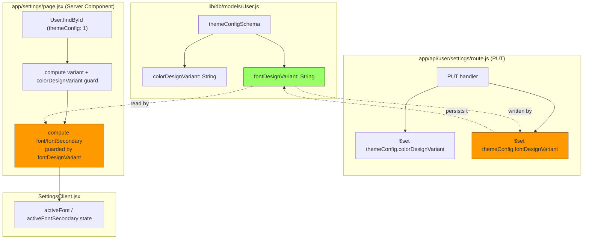

# Fix: Default font not applied when user changes theme

## Goal

When a user switches their design/theme variant on `/settings/design`, the
Settings page (`/settings`) should immediately show that variant's default
font — without the user having to manually click the font option and save
before it "sticks".

## Context

`themeConfig` already tracks **colors** with a variant-tracking field,
`colorDesignVariant`, specifically to detect stale saved values after a
design switch:

```js
// app/settings/page.jsx (existing, lines 44-46)
const colorDesignVariant = user?.themeConfig?.colorDesignVariant ?? "";
const savedColors =
  colorDesignVariant === variant ? (user?.themeConfig?.colors ?? {}) : {};
```

**Fonts have no equivalent field.** `app/settings/page.jsx` (lines 53-62)
unconditionally trusts any previously-saved `themeConfig.font` /
`themeConfig.fontSecondary`:

```js
font: user?.themeConfig?.font ?? VARIANT_FONT_DEFAULTS[variant]?.primary ?? "oswald",
fontSecondary: user?.themeConfig?.fontSecondary ?? VARIANT_FONT_DEFAULTS[variant]?.secondary ?? "rajdhani",
```

So: user picks design **A** → saves a font for A → switches to design **B**
via `DesignPickerClient.jsx` (whose `save()` only PUTs
`{ designVariant, tournamentDesigns }`, never touches font) → reopens
`/settings` → page still shows design A's saved font value, not B's default.
Clicking the font picker and saving again is what finally overwrites
`themeConfig.font`, masking the real bug.

`app/api/theme/[userId]/[tournamentID]/route.js` (the route that actually
renders live widgets) is unaffected — it derives fonts purely from
`tournamentFonts[tid] ?? variantFontDefaults.primary`, never from
`themeConfig.font`. **This bug is confined to the Settings UI's displayed
default**, not live broadcast output.

No `fontDesignVariant` field exists in `themeConfigSchema`
(`lib/db/models/User.js`), and `app/api/user/settings/route.js`'s PUT handler
never writes one — confirming the asymmetry with the color pattern.

## Strategy

Mirror the existing `colorDesignVariant` pattern exactly, for fonts:

1. **Schema**: add `fontDesignVariant: { type: String, default: "" }` to
   `themeConfigSchema` (right next to `colorDesignVariant`, same shape/intent).
2. **API write path**: in the PUT handler, whenever `body.font` or
   `body.fontSecondary` is saved alongside a `body.designVariant`, also write
   `themeConfig.fontDesignVariant = body.designVariant` — same structure as
   the existing `colorDesignVariant` write inside the `body.colors` block.
3. **Server read path**: in `app/settings/page.jsx`, only trust the saved
   `font`/`fontSecondary` when `fontDesignVariant === variant`; otherwise fall
   back to `VARIANT_FONT_DEFAULTS[variant]`.

No projection change is needed in `page.jsx` — `User.findById` already
selects the whole `themeConfig: 1` subdocument, so the new field is included
automatically once it exists in the schema.

This is the minimal, professional fix: it closes the gap by reusing a pattern
that's already proven correct for colors, touching only the three files where
the asymmetry lives.

## Tasks

1. Add `fontDesignVariant` field to `themeConfigSchema` in
   [User.js](lib/db/models/User.js#L10-L22).
2. Persist `themeConfig.fontDesignVariant` in the PUT handler of
   [route.js](app/api/user/settings/route.js#L113-L124) whenever font(s) are
   saved with a `designVariant`.
3. Gate the `font` / `fontSecondary` props computed in
   [page.jsx](app/settings/page.jsx#L53-L62) on
   `fontDesignVariant === variant`, falling back to
   `VARIANT_FONT_DEFAULTS[variant]` when they don't match — mirroring
   `savedColors` (lines 44-46).
4. Manual verification: as a fresh user, pick design A → set/save a custom
   font → switch to design B via `/settings/design` → reopen `/settings` →
   confirm the font field shows design B's default immediately, with no need
   to re-click and re-save.

## Risks

- **Existing users with previously-saved fonts**: their `fontDesignVariant`
  will be `""` (schema default), which won't match their current `variant`
  (e.g. `"default"`). On their next page load, their saved
  `themeConfig.font`/`fontSecondary` will be ignored in favor of the variant
  default — effectively a one-time reset, identical to what already happened
  (or will happen) for `colorDesignVariant` adopters. No migration script
  exists for `colorDesignVariant` either (checked `scripts/` — only
  `seed-admin.js` and `sync-indexes.js` exist), so this asymmetric one-time
  reset is the established, accepted behavior for this pattern. Once the user
  saves again, `fontDesignVariant` gets correctly populated and future
  variant switches behave correctly. No backfill migration is proposed, to
  stay consistent with how `colorDesignVariant` was rolled out.
- **Scoped/tournament fonts** (`tournamentFonts[scope]`,
  `activeFont` in `SettingsClient.jsx`) are untouched by this fix — they
  already derive correctly from `VARIANT_FONT_DEFAULTS[effectiveVariant]`
  when no per-tournament override exists (lines 131-138), and are out of
  scope for this bug report.

## Architecture Diagram


