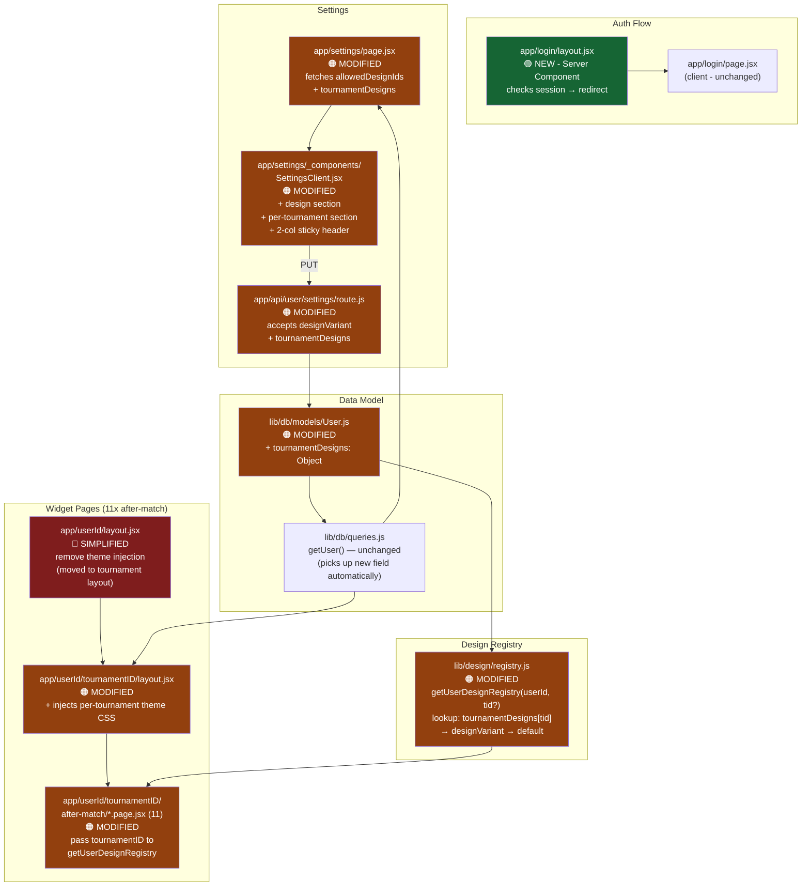

# Plan: Login Redirect + Settings Overhaul + Per-Tournament Design
**Created:** 2026-05-17
**Status:** draft
**Goal:** Three coordinated improvements — (1) prevent authenticated users from re-visiting /login, (2) overhaul the /settings page with design selection, per-tournament design overrides, sticky header, and 2-column layout, and (3) extend the data model and widget rendering to support per-tournament design overrides.

---

## Context

### Current state
- `/login` is a pure client component with no auth-awareness — a logged-in user who navigates there sees the form instead of being redirected
- `/settings` only exposes color customisation; design variant is shown read-only and says "assigned by admin"
- `User.themeConfig.designVariant` is a single string — one design for all tournaments
- Widget pages call `getUserDesignRegistry(userId)` which reads that single value
- `getUserDesignRegistry` has no awareness of which tournament is being displayed

### Key files
| File | Role |
|---|---|
| `app/login/page.jsx` | Client component — no session check |
| `middleware.js` | Guards `/admin`, `/controller`, `/settings` — NOT `/login` |
| `app/settings/page.jsx` | Server wrapper — fetches session + user |
| `app/settings/_components/SettingsClient.jsx` | Client — colors only |
| `app/api/user/settings/route.js` | GET/PUT themeConfig.colors only |
| `lib/db/models/User.js` | Schema — needs `tournamentDesigns` field |
| `lib/design/registry.js` | `getUserDesignRegistry(userId)` — no tid param |
| `app/[userId]/[tournamentID]/after-match/*/page.jsx` | 11 pages call getUserDesignRegistry |
| `app/[userId]/layout.jsx` | Injects theme CSS vars from user.themeConfig |

---

## Data Model Decision: Option A — `tournamentDesigns` map on User

```js
// Added to userSchema
tournamentDesigns: { type: Object, default: {} }
// Stored as: { "TRN-2026-001": "mythical", "TRN-2026-002": "default" }
```

**Why option A over B and C:**
- No extra collection/join (option B would require a second DB query per widget page)
- Loaded in the same `User.findById()` call already made by `getUser()`
- Lookup is O(1): `user.tournamentDesigns?.[tid] ?? user.themeConfig.designVariant`
- Easy atomic update: `$set: { ["tournamentDesigns.TRN-001"]: "mythical" }`

**Lookup priority chain (widget pages):**
```
tournamentDesigns[tid]  →  themeConfig.designVariant  →  "default"
```

---

## Strategy

### Task 1 — Login redirect
Add `app/login/layout.jsx` as a Server Component that reads the session and redirects authenticated users. Keeps `login/page.jsx` untouched (still a client component).

### Task 2 — Settings page overhaul
- Add design selector section (radio cards from `user.allowedDesignIds`)
- Add per-tournament overrides section (one card per tournament ID with its own design selector)
- Keep color section
- Sticky header, 2-column layout (left: design + tournaments, right: colors)
- Update `PUT /api/user/settings` to also save `designVariant` and `tournamentDesigns`
- Update `GET /api/user/settings` to return them

### Task 3 — Per-tournament design in widgets
- Add `tournamentDesigns` to User schema
- Update `getUserDesignRegistry(userId, tournamentID?)` to accept optional tournamentID
- Update all 11 after-match widget pages + both layout files to pass `tournamentID`
- Update `[userId]/layout.jsx` to inject the right theme per-tournament

---

## Tasks
1. **login-redirect** — Add login/layout.jsx to redirect authenticated users away from /login
2. **settings-overhaul** — Rebuild /settings with design selection, per-tournament overrides, sticky header, 2-column
3. **tournament-design-model** — Add tournamentDesigns to schema, update registry + all widget pages

---

## Risks
- `tournamentDesigns` object keys cannot contain `.` in MongoDB field names — tournament IDs like "TRN.001" would break `$set`. Document in schema comment to use `-` or `_` separators.
- `[userId]/layout.jsx` currently injects CSS vars for the user's default theme. After Task 3, it needs both `userId` AND `tournamentID` to inject the correct per-tournament theme. The tournament layout already has `tournamentID` in params — the fix is to move theme injection down to `[userId]/[tournamentID]/layout.jsx` and remove it from `[userId]/layout.jsx`.
- All 11 after-match pages need updating — mechanical but must not be missed.
- `getUser()` in `lib/db/queries.js` currently fetches the full user (cached). After adding `tournamentDesigns`, no query change needed — the field just appears automatically.

---

## Architecture Diagram


