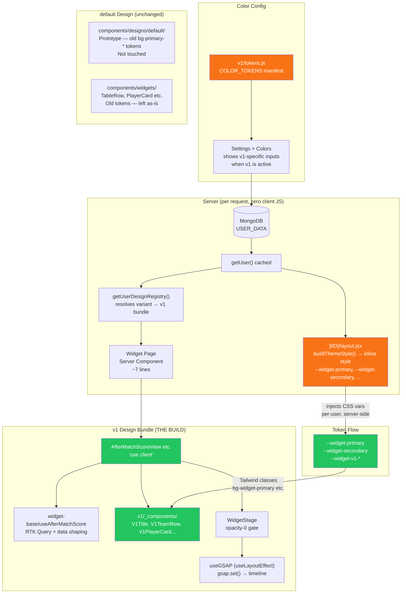

# Plan: v1 Official Design Bundle — Architecture & Build

**Created:** 2026-05-19
**Status:** awaiting-approval
**Goal:** Build the first production-quality design bundle (v1) — reusable, token-driven, properly layered, zero repetition.

---

## Context: What exists today

| Layer                  | Location                                    | Status       | Problem                                                |
| ---------------------- | ------------------------------------------- | ------------ | ------------------------------------------------------ |
| **Pages** (server)     | `app/[userId]/[tID]/after-match/*/page.jsx` | ✅ Done      | 7-line server components, call `getUserDesignRegistry` |
| **Registry**           | `lib/design/registry.js`                    | ✅ Done      | BUNDLE_MAP, TTL cache, `getUserDesignRegistry()`       |
| **Token catalog**      | `lib/design/catalog.js`                     | ✅ Done      | VARIANT_DEFAULTS, buildThemeStyle, TOKEN_MAP           |
| **CSS vars injection** | `[tID]/layout.jsx`                          | ✅ Done      | Injects `--widget-*` vars server-side, zero flicker    |
| **Data hooks**         | `components/widget-base/`                   | ✅ Done      | One hook per widget, shapes RTK Query data             |
| **Animation gate**     | `components/common/WidgetStage`             | ✅ Done      | opacity-0 until all `` load, fires onReady        |
| **v1 stubs**           | `components/designs/v1/`                    | 🟡 Empty     | 11 files all returning `null`                          |
| **default design**     | `components/designs/default/`               | 🟡 Prototype | Uses OLD `bg-primary-shade-*` static tokens            |
| **Shared primitives**  | `components/widgets/`                       | 🔴 Problem   | Hard-wired to old static tokens, not per-user          |

### The two-token-system problem

```
OLD (static globals) ──── bg-primary, bg-primary-shade-one, bg-primary-shade-two
                          Set once in globals.css. Never overridden per user.
                          Used by: default design, TableRow, PlayerCard, Title, MVPStats, HighLightTeam

NEW (per-user, injected) ─ bg-widget-primary, bg-widget-secondary, bg-widget-bg ...
                            Injected as inline CSS vars by [tournamentID]/layout.jsx (Server Component).
                            Used by: nothing yet except v1/tokens.js manifest
```

**v1 must use ONLY the new `--widget-*` tokens.** The `default` design stays as-is (prototype). None of the `components/widgets/` prototype components are reusable for v1 because they use old tokens.

---

## The "special color" architecture

This is a three-tier system, already supported — nothing new to build:

```
Tier 1 — Standard configurable (every design)
  --widget-primary, --widget-secondary, --widget-bg, --widget-text, etc.
  User sets in Settings > Colors. Injected by layout. Works for all designs.

Tier 2 — Design-specific configurable (v1 extras)
  --widget-v1-accent, --widget-v1-gold, etc.
  Declared in v1/tokens.js → settings UI shows them only when v1 is active.
  Default values in globals.css :root + VARIANT_DEFAULTS in catalog.js.
  User CAN change them.

Tier 3 — Locked brand color (enterprise)
  Hardcoded CSS literal in the component (e.g., color: #1a73e8).
  NOT in tokens.js → invisible to settings UI → user cannot change it.
  Reserve this for contractually fixed sponsor/brand colors only.
```

**Answer to "keep color changing feature while having special colors":**

- Tier 2 for design-specific defaults that users can still override
- Admin sets a user's `VARIANT_DEFAULTS` by assigning the correct design variant
- Different clients on the same design get different starting palettes via VARIANT_DEFAULTS

---

## Strategy

1. **Do NOT touch `default` design** — it's prototype, it works for demos, leave it alone
2. **Do NOT modify `components/widgets/`** — these are default's internal components
3. **Build v1 fully self-contained inside `components/designs/v1/`**
4. Shared building blocks for v1 go in `components/designs/v1/_components/` (scoped, not promoted until genuinely needed across designs)
5. **Always use `widget-base/` hooks** — never call RTK Query directly in a view
6. **Always use `WidgetStage` + `useGSAP`** — consistent animation gate
7. **Always use `--widget-*` Tailwind classes** — per-user theming works automatically

---

## Folder structure after this plan

```
components/
├── common/                       ← unchanged: Layout, WidgetStage (infrastructure)
├── widget-base/                  ← unchanged: data hooks
├── widgets/                      ← unchanged: default's prototype components
└── designs/
    ├── default/                  ← unchanged: prototype design
    └── v1/                       ← THE WORK
        ├── index.js              ← unchanged: barrel exports
        ├── tokens.js             ← MODIFIED: add any v1-specific tokens
        ├── GUIDE.md              ← unchanged: developer reference
        ├── _components/          ← NEW: v1 shared sub-components
        │   ├── V1Title.jsx       ← tournament title bar (--widget-* tokens)
        │   ├── V1TeamRow.jsx     ← standings table row
        │   ├── V1Header.jsx      ← standings column header
        │   ├── V1PlayerCard.jsx  ← player stat card
        │   └── V1DataBox.jsx     ← stat box (match summary)
        ├── AfterMatchScoreView.jsx      ← BUILT: uses V1TeamRow, V1Header, V1Title
        ├── AfterMatchScoreGroupView.jsx ← BUILT: reuses same primitives
        ├── MatchSummaryView.jsx         ← BUILT: uses V1DataBox, V1Title
        ├── MVPView.jsx                  ← BUILT: complex character animation
        ├── MVPGroupView.jsx             ← BUILT: reuses MVP layout
        ├── HeadToHeadView.jsx           ← BUILT
        ├── TopPlayersView.jsx           ← BUILT: uses V1PlayerCard
        ├── TopPlayersGroupView.jsx      ← BUILT: reuses same
        ├── WWCView.jsx                  ← BUILT
        ├── WWCTwoView.jsx               ← BUILT
        └── WWCStatsView.jsx             ← BUILT
```

---

## Tasks

| #   | Name             | What gets built                                                                                                                   | Shared output                             |
| --- | ---------------- | --------------------------------------------------------------------------------------------------------------------------------- | ----------------------------------------- |
| 1   | `v1-foundation`  | `_components/`: V1Title, V1TeamRow, V1Header, V1PlayerCard, V1DataBox. Any v1-specific token additions to tokens.js + globals.css | Primitives used by all later tasks        |
| 2   | `v1-standings`   | AfterMatchScoreView, AfterMatchScoreGroupView                                                                                     | Validates V1TeamRow + V1Header in context |
| 3   | `v1-mvp-summary` | MVPView, MVPGroupView, MatchSummaryView                                                                                           | Most complex animations                   |
| 4   | `v1-players-h2h` | TopPlayersView, TopPlayersGroupView, HeadToHeadView                                                                               | V1PlayerCard in context                   |
| 5   | `v1-wwc`         | WWCView, WWCTwoView, WWCStatsView                                                                                                 | Final batch                               |

Each task is independent after Task 1 completes.

---

## Risks

| Risk                                                                                       | Mitigation                                                                                                                                                                                    |
| ------------------------------------------------------------------------------------------ | --------------------------------------------------------------------------------------------------------------------------------------------------------------------------------------------- |
| v1 visual design not specified — what should it look like?                                 | **Blocker.** Need at least a rough direction (colors, layout style) before Task 2. Primitives in Task 1 are intentionally structure-only (div layout) — color comes from CSS vars at runtime. |
| Animating GSAP on CSS-var-driven elements can cause flash if `gsap.set()` runs after paint | Already solved by `useGSAP` (useLayoutEffect internally) — `gsap.set()` fires before browser paint. Pattern established in default design.                                                    |
| MVP requires a character image asset per player                                            | Data comes from API (`player_imageUrl`). No action needed — same as default design.                                                                                                           |
| WWCTwo and WWCStats share the same `useWWC` hook data but different visuals                | Both already use `useGetWwcdTeamStatsQuery` internally via `useWWC` hook — handled.                                                                                                           |

---

## Architecture Diagram



---

## Before / After

```
BEFORE                              AFTER
──────────────────────────────      ──────────────────────────────
v1/ has 11 files returning null     v1/ has 11 fully working views
default/ components shared          v1/ fully self-contained
Direct RTK Query calls              All data via widget-base/ hooks
Old bg-primary tokens in default    v1 uses --widget-* (per-user)
No shared v1 primitives             v1/_components/ for reuse
No v1-specific token docs           tokens.js complete
```
