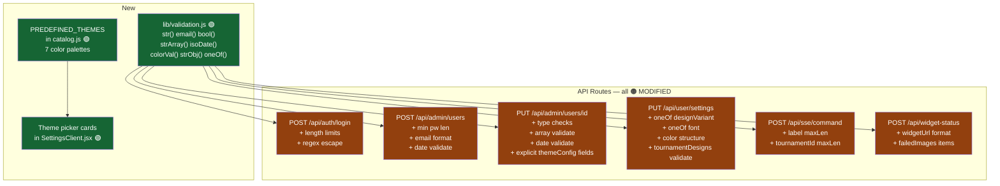

# Plan: API Input Validation + Predefined Theme Picker

**Created:** 2026-05-17
**Status:** draft
**Goal:** Harden all API routes with consistent server-side input validation (no heavy libs — a shared 60-line helper file + per-route checks), and add a predefined color theme picker to the settings page so users can apply full color palettes from a curated list without touching the DB schema.

---

## Context

### Validation gaps found

| Route                           | Gap                                                                                                                                                                       |
| ------------------------------- | ------------------------------------------------------------------------------------------------------------------------------------------------------------------------- |
| `POST /api/auth/login`          | No length limits; regex injection in name `$or` query (`^${input}$` — unescaped user input)                                                                               |
| `POST /api/admin/users`         | No min password length; no max lengths; invalid date not caught                                                                                                           |
| `PUT /api/admin/users/[userId]` | `name.trim()` could become ""; `isActive` not type-checked as boolean; arrays not validated; date not validated; `themeConfig` accepted as-is                             |
| `PUT /api/user/settings`        | `designVariant` not checked against allowed values; `font` not checked against `WIDGET_FONTS`; `colors` structure not validated; `tournamentDesigns` values not validated |
| `POST /api/sse/command`         | `label` unlimited length; `tournamentId` unlimited length                                                                                                                 |
| `POST /api/widget-status`       | `widgetUrl` not validated as path; `failedImages` items not validated; no auth                                                                                            |

### Routes already adequate

- GET routes with no body: safe
- `POST /api/sse/command`: url validated ✓, auth added ✓
- Auth on admin routes: all have `requireAdmin()` ✓

### Theme picker

- Currently `VARIANT_DEFAULTS` in `lib/design/catalog.js` has 2 color sets (default, mythical)
- `SettingsClient.jsx` has color editors but no quick-apply themes
- No schema changes needed — themes only populate client-side state

---

## Strategy

### Task 1 — Shared validation helpers + all routes

Create `lib/validation.js` with small, composable helpers. Apply them route-by-route. Also escape the regex input in login to prevent injection.

Validator helpers:

```js
str(val, { min, max }); // string, trim, length bounds
email(val); // str + basic format check
bool(val); // typeof === "boolean"
strArray(val, { maxItems, maxLen }); // array of strings with limits
isoDate(val); // valid Date or null
colorVal(val); // string ≤ 50 chars (covers hex/rgb/rgba/hsl)
strObj(val, { maxKeys, maxValLen }); // flat object with string values
oneOf(val, allowed); // val must be in the allowed list
```

Each validator returns `null` on pass, or a string error message on fail.

### Task 2 — Predefined color themes

Add `PREDEFINED_THEMES` array to `lib/design/catalog.js` — 7 themed palettes. Add a "Themes" card section at the top of the right panel in `SettingsClient.jsx`. Clicking a theme card calls `setColors(theme.colors)` — no persistence, user still must click Save.

---

## Tasks

1. **api-validation** — Create lib/validation.js helpers and apply to all 6 routes with gaps
2. **theme-picker** — Add PREDEFINED_THEMES to catalog + theme picker UI in SettingsClient

---

## Risks

- Over-validating `colors` could break existing saved values (rgba, named colors, CSS vars). Keep color validation loose — just `typeof string && length ≤ 50`.
- `themeConfig` in admin PUT: currently accepted as-is. Replace with explicit field handling (`designVariant`, `font`) instead of blind object assignment.
- Regex escaping in login: `input.replace(/[.*+?^${}()|[\]\\]/g, '\\$&')` — must not break the "admin" username case.
- `POST /api/widget-status` has no auth — this is called by OBS browser sources (no cookie). Keep it unauthed but add strict payload validation.

---

## Architecture Diagram


