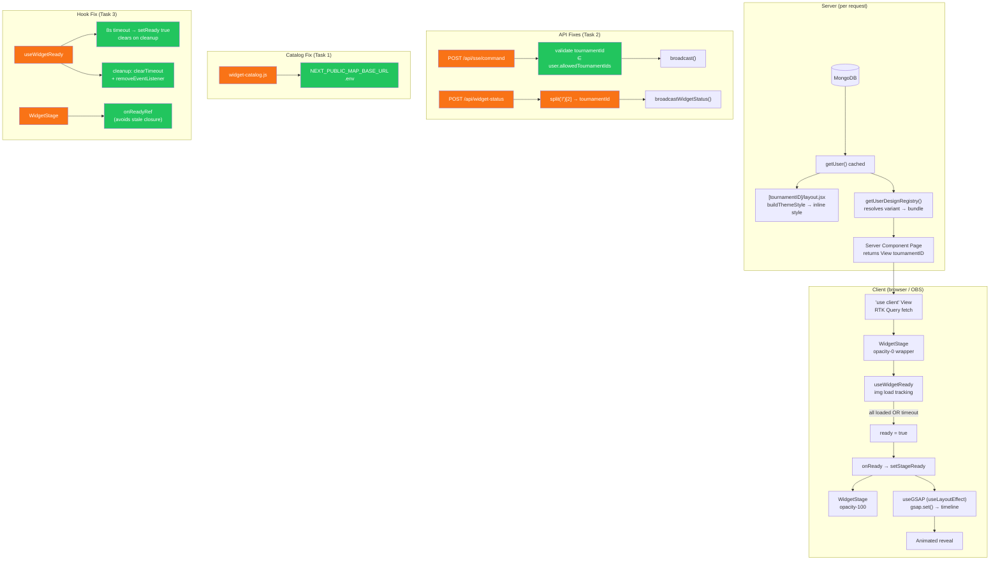

# Plan: Widget Pipeline Hardening

**Created:** 2026-05-19
**Status:** completed
**Goal:** Fix three confirmed bugs and harden the image-load → GSAP animation pipeline for zero-flicker live broadcasting.

---

## Context

The broadcast display pipeline is:

```
DB → SSR layout (CSS vars injected) → Server Component (resolves design bundle)
  → Client View Component (RTK Query) → WidgetStage (gates opacity on images)
    → useWidgetReady (img load tracking) → onReady → useGSAP (animates in)
```

The design registry and theme injection are architecturally sound:

- CSS vars arrive via SSR inline `style` — no FOUC, no client flash
- `getUserDesignRegistry` resolves the correct design bundle server-side
- `useGSAP` (which uses `useLayoutEffect` internally) fires synchronously before paint, so `gsap.set()` runs before the browser renders the newly-visible container — the opacity-0 → animate-in sequence is frame-perfect

**Issues confirmed in the current implementation:**

1. **Map widget URLs are hardcoded to `localhost:10087`** — broken in every non-local environment
2. **`/api/widget-status` extracts the wrong URL segment** — `split("/")[1]` gives `userId`, not `tournamentId`; the load-error banner in the controller has never worked
3. **`/api/sse/command` has no tournament ownership check** — any authenticated user can broadcast to any tournament
4. **`useWidgetReady` has no cleanup and no timeout** — stale listeners if the effect re-runs; silent hang forever if an image CDN stalls mid-broadcast
5. **`WidgetStage` `onReady` is missing from `useEffect` deps** — stale closure risk if `onReady` ever changes before `ready` becomes true

---

## Strategy

Four small, isolated tasks. Each touches one layer with no cross-task dependencies — they can be reviewed and shipped independently.

- No changes to the design registry architecture (it's correct)
- No changes to the GSAP animation logic (it's correct)
- No changes to CSS var injection (it's correct)
- Touch only the confirmed broken/fragile spots

---

## Tasks

| #   | Task                             | Files                                                                                 | Impact                                                |
| --- | -------------------------------- | ------------------------------------------------------------------------------------- | ----------------------------------------------------- |
| 1   | `fix-map-url-env`                | `lib/widget-catalog.js`, `.env`                                                       | Map widgets work in any environment                   |
| 2   | `fix-widget-status-and-sse-auth` | `app/api/widget-status/route.js`, `app/api/sse/command/route.js`, `lib/db/queries.js` | Load-error banner works; broadcast auth enforced      |
| 3   | `harden-widget-ready`            | `hooks/useWidgetReady.js`, `components/common/WidgetStage.jsx`                        | No silent hang; no listener leaks; correct React deps |

---

## Risks

- **Task 2 SSE auth**: Validating `tournamentId` against `allowedTournamentIds` requires a DB lookup per command. Mitigated by reading it from the already-verified JWT payload (user object from `requireSession`), then fetching the user's allowed list — already cached by `getUser()` via React `cache()` in the same request tree. A `getUserAllowedTournaments(userId)` helper in `lib/db/queries.js` keeps this clean.
- **Task 3 timeout**: Choosing the right default timeout. Too short = widget flashes in with broken images on slow CDNs. Too long = operator waits too long for error feedback. Proposed: **8 seconds** — long enough for any reasonable CDN round-trip, short enough to be actionable during a live match.
- **Task 3 cleanup**: Removing `{ once: true }` and tracking listeners manually means more code. Keeping `{ once: true }` but also returning a no-op cleanup is the minimal path — the `{ once: true }` already prevents listener accumulation after firing. The timeout `clearTimeout` in cleanup is the critical part.

---

## Architecture Diagram



---

## Review Checklist (post-implementation)

- [ ] Map widgets load in production deployment
- [ ] Load-error banner appears in controller when a widget image fails
- [ ] User B cannot send SSE commands to User A's tournament
- [ ] Widget stays visible after 8s even if an image CDN hangs (OBS test)
- [ ] No duplicate listener warnings in browser console on data refetch
