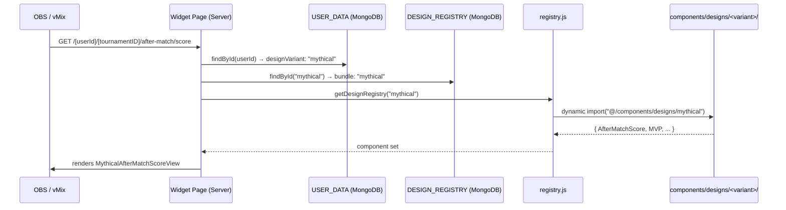
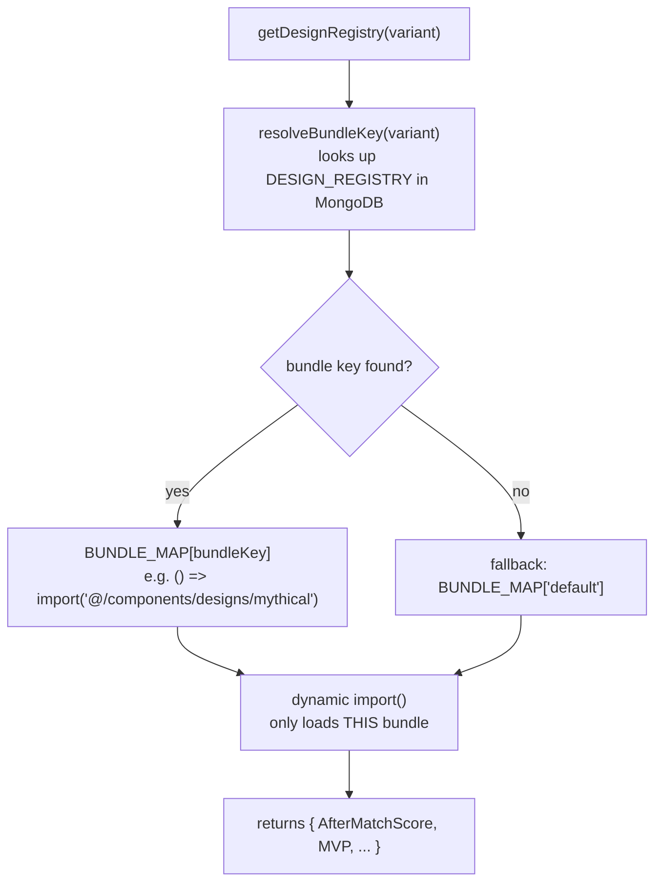
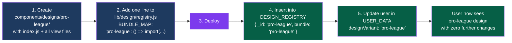

# Design Registry System

## Overview

The design registry allows each user to be assigned a completely different widget layout with zero code changes. Adding a new design requires code once (create the components + one registry entry). Assigning it to any number of users is a database update only.

---

## How a widget renders



---

## Folder structure

```
pubg-widget/
├── components/
│   └── designs/
│       ├── default/              ← one folder per design
│       │   ├── index.js          ← barrel: exports all components by slot name
│       │   ├── AfterMatchScoreView.jsx
│       │   ├── AfterMatchScoreGroupView.jsx
│       │   ├── MatchSummaryView.jsx
│       │   ├── MVPView.jsx
│       │   ├── MVPGroupView.jsx
│       │   ├── HeadToHeadView.jsx
│       │   ├── TopPlayersView.jsx
│       │   ├── TopPlayersGroupView.jsx
│       │   ├── WWCView.jsx
│       │   ├── WWCTwoView.jsx
│       │   └── WWCStatsView.jsx
│       └── mythical/             ← copy default/ and modify styles/layout
│           ├── index.js
│           └── ...same file names
│
├── lib/
│   └── design/
│       ├── registry.js           ← BUNDLE_MAP + getDesignRegistry()
│       ├── get-user-design.js    ← cached DB call: userId → designVariant
│       └── catalog.js            ← CSS variable tokens per variant
│
└── lib/db/
    └── models/
        └── DesignRegistry.js     ← Mongoose model for DESIGN_REGISTRY collection
```

---

## The two database collections

### `USER_DATA` — one document per user
```json
{
  "_id": "69e2b11773000bcffc46799b",
  "email": "user@example.com",
  "themeConfig": {
    "designVariant": "mythical",
    "colors": {
      "color1": "#007570",
      "color2": "#00B194",
      "color3": "#00473C",
      "color4": "#ffdd75",
      "color5": "#00473c"
    }
  }
}
```

### `DESIGN_REGISTRY` — one document per design
```json
{ "_id": "default",  "bundle": "default",  "label": "Default Theme",  "active": true }
{ "_id": "mythical", "bundle": "mythical", "label": "Mythical Theme",  "active": true }
```

`_id` = the string stored in `USER_DATA.themeConfig.designVariant`  
`bundle` = the key in `BUNDLE_MAP` inside `registry.js`

---

## How `registry.js` works



**Key point:** `BUNDLE_MAP` contains explicit `import()` calls — the bundler tree-shakes each one into a separate chunk. Only the requested chunk loads at runtime.

---

## CSS variable theming (color config)

Colors are stored as generic slots in MongoDB and mapped to CSS variables at the layout level:

| DB slot | CSS variable          | Tailwind utility       |
|---------|-----------------------|------------------------|
| color1  | `--primary`           | `bg-primary`           |
| color2  | `--primary-shade-one` | `bg-primary-shade-one` |
| color3  | `--primary-shade-two` | `bg-primary-shade-two` |
| color4  | `--custom-yellow`     | `bg-custom-yellow`     |
| color5  | `--custom-green`      | `bg-custom-green`      |

`[userId]/layout.jsx` is a **Server Component** — it fetches the config and injects a `<style>` tag before sending HTML to the browser. **No JavaScript needed at runtime = zero flicker in OBS/vMix.**

---

## Adding a new design (step by step)



Steps 1–3 are code + one deployment.  
Steps 4–5 are database updates only — no deploy, no code change.  
Any number of users can be assigned the same design at any time.

---

## Slot names (contract between pages and designs)

Every design **must** export these exact names from its `index.js`. The slot name is what the widget page imports.

| Slot name             | Route                          |
|-----------------------|--------------------------------|
| `AfterMatchScore`     | `after-match/score`            |
| `AfterMatchScoreGroup`| `after-match/score-group`      |
| `MatchSummary`        | `after-match/match-summary`    |
| `MVP`                 | `after-match/mvp`              |
| `MVPGroup`            | `after-match/mvp-group`        |
| `HeadToHead`          | `after-match/head-to-head`     |
| `TopPlayers`          | `after-match/top-players`      |
| `TopPlayersGroup`     | `after-match/top-players-group`|
| `WWC`                 | `after-match/wwc`              |
| `WWCTwo`              | `after-match/wwc-two`          |
| `WWCStats`            | `after-match/wwc-stats`        |

Each view component receives a single prop: `tournamentID: string`.

---

## What each widget page looks like

Every after-match page is now ~7 lines:

```jsx
// app/[userId]/[tournamentID]/after-match/score/page.jsx
import { getUserDesign }    from "@/lib/design/get-user-design";
import { getDesignRegistry } from "@/lib/design/registry";

export default async function AfterMatchScore({ params }) {
  const { userId, tournamentID } = await params;
  const variant = await getUserDesign(userId);
  const { AfterMatchScore: View } = await getDesignRegistry(variant);
  return <View tournamentID={tournamentID} />;
}
```

The page is a **Server Component**. The view component is a **Client Component** (handles hooks, RTK Query, GSAP). No client/server boundary issues — Next.js handles this automatically.

---

## Seeding the DESIGN_REGISTRY collection

Hit this endpoint **once** after deployment, then delete the file:

```
GET /api/admin/seed-designs
```

File: `app/api/admin/seed-designs/route.js` — **delete after use**.
