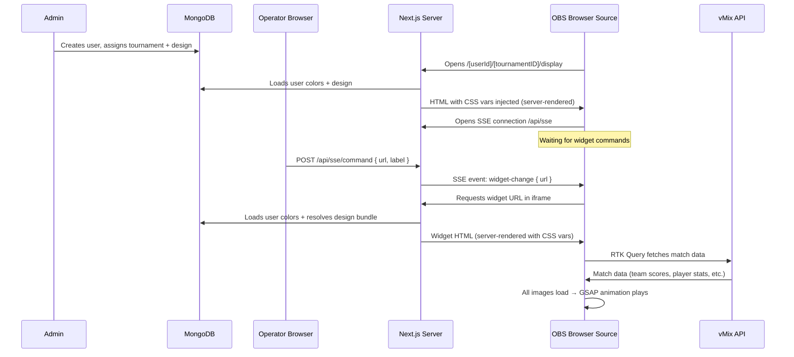
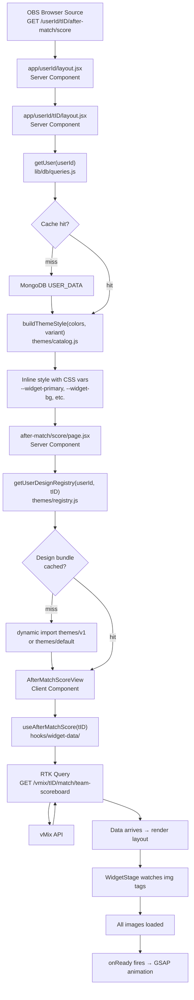
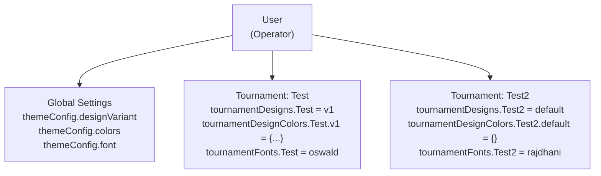
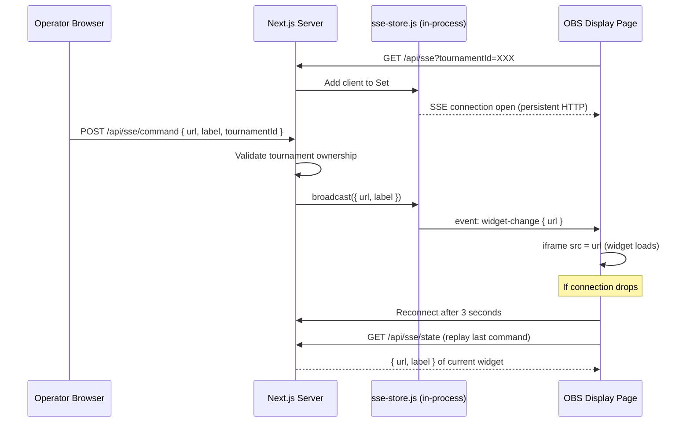
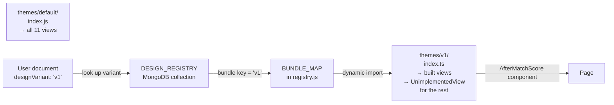
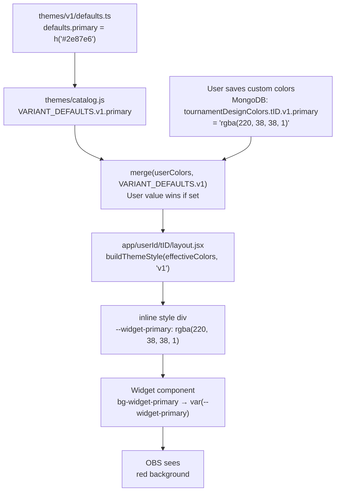
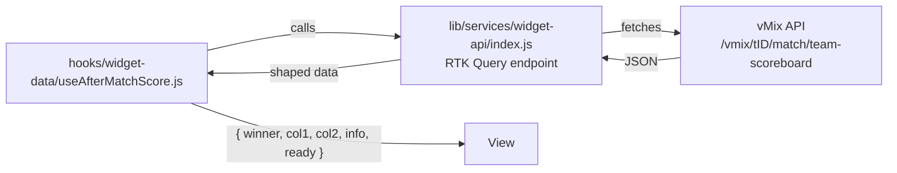
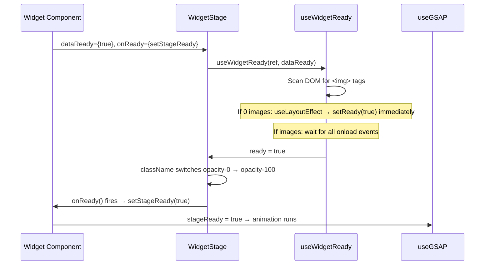
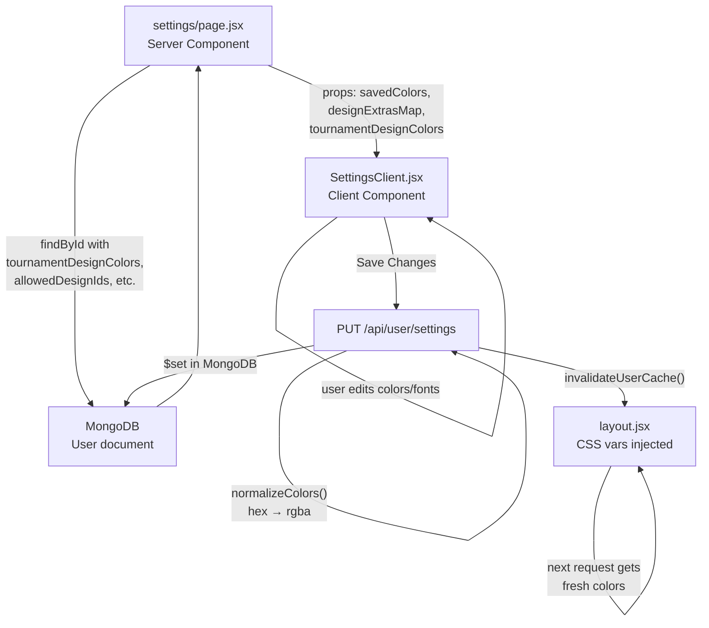
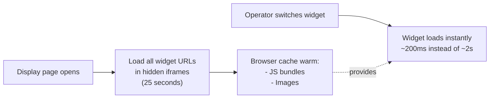

# Effinity PUBG Widget Platform — Master Documentation

> **For junior developers.** Read this top to bottom once before touching any code.
> Everything from how a button click in the controller becomes a visible widget in OBS
> is documented here, with diagrams.

---

## Table of Contents

1. [What Is This Project?](#1-what-is-this-project)
2. [How the Broadcast Works (Big Picture)](#2-how-the-broadcast-works-big-picture)
3. [Folder Structure](#3-folder-structure)
4. [The Request Flow — Widget Rendering End to End](#4-the-request-flow--widget-rendering-end-to-end)
5. [Multi-Tenant System — Users, Tournaments, Designs](#5-multi-tenant-system--users-tournaments-designs)
6. [SSE — How Widget Switching Works](#6-sse--how-widget-switching-works)
7. [Design System — Themes, Bundles, Registry](#7-design-system--themes-bundles-registry)
8. [Color Token System](#8-color-token-system)
9. [Building a Widget — Step by Step](#9-building-a-widget--step-by-step)
10. [Adding a New Extra Color Token to v1](#10-adding-a-new-extra-color-token-to-v1)
11. [Adding a Completely New Design](#11-adding-a-completely-new-design)
12. [Data Hooks Reference](#12-data-hooks-reference)
13. [WidgetStage + Animation System](#13-widgetstage--animation-system)
14. [Settings Page — How It Works](#14-settings-page--how-it-works)
15. [Caching System](#15-caching-system)
16. [Admin Panel](#16-admin-panel)
17. [Database Schema](#17-database-schema)
18. [Environment Variables](#18-environment-variables)
19. [Common Mistakes and Gotchas](#19-common-mistakes-and-gotchas)

---

## 1. What Is This Project?

A **broadcast widget platform** for PUBG esports tournaments. It allows an operator (broadcast director) to control which widget is shown on a broadcast screen (OBS/vMix) in real time, without touching OBS at all.

**The three roles:**

| Role     | Tool                               | What they do                                        |
| -------- | ---------------------------------- | --------------------------------------------------- |
| Admin    | `/admin`                           | Creates users, assigns tournaments and designs      |
| Operator | `/controller/[tournamentID]`       | Clicks buttons to switch which widget OBS shows     |
| OBS      | `/[userId]/[tournamentID]/display` | Browser source — renders whatever the operator sent |

**Key design decisions:**

- Colors, fonts, and design (layout) are **per-user per-tournament** — two operators can have completely different visual styles
- Widget data comes from an **external API (vMix)** — this platform does NOT store match data
- Everything is styled via **server-injected CSS variables** — zero flicker, zero layout shift in OBS

---

## 2. How the Broadcast Works (Big Picture)



---

## 3. Folder Structure

```
pubg-widget/
│
├── app/                              ← Next.js App Router pages and API routes
│   ├── globals.css                   ← CSS vars declared transparent + Tailwind aliases
│   ├── layout.jsx                    ← Root layout: fonts loaded, Redux provider
│   ├── page.jsx                      ← Redirects / → /controller
│   │
│   ├── [userId]/[tournamentID]/      ← All widget URLs live here
│   │   ├── layout.jsx                ← ★ KEY FILE: fetches user from DB, injects
│   │   │                                CSS vars as inline style on a wrapper div.
│   │   │                                This makes all widgets get the right colors
│   │   │                                without any client-side JS.
│   │   ├── display/page.jsx          ← OBS browser source. Listens for SSE and
│   │   │                                shows the active widget in an iframe.
│   │   ├── widgets/page.jsx          ← List of all direct widget URLs (for OBS setup)
│   │   └── after-match/
│   │       ├── score/page.jsx        ← ~7 lines. Resolves design bundle, renders view.
│   │       ├── score-group/page.jsx
│   │       └── ... (one page per widget slot)
│   │
│   ├── controller/
│   │   ├── page.jsx                  ← Tournament selector (if user has multiple)
│   │   └── [tournamentID]/
│   │       └── _components/ControllerClient.jsx  ← Button grid to switch widgets
│   │
│   ├── settings/
│   │   ├── page.jsx                  ← Theme settings (colors, fonts)
│   │   ├── _components/SettingsClient.jsx
│   │   └── design/
│   │       ├── page.jsx              ← Design picker (v1, default, etc.)
│   │       └── _components/DesignPickerClient.jsx
│   │
│   ├── admin/                        ← Admin panel (create users, manage designs)
│   │
│   └── api/
│       ├── sse/route.js              ← SSE stream endpoint (display page connects here)
│       ├── sse/command/route.js      ← Controller POSTs here to switch widgets
│       ├── sse/state/route.js        ← Returns current widget (for reconnect)
│       ├── widget-status/route.js    ← Widget reports image load failures here
│       ├── user/settings/route.js    ← Save colors, fonts, design
│       ├── theme/[userId]/[tID]/     ← Returns resolved CSS vars as JSON
│       └── admin/                   ← Admin-only routes
│
├── themes/                           ← ★ ALL DESIGN CODE LIVES HERE
│   ├── utils.js                      ← h() helper: hex → rgba conversion
│   ├── catalog.js                    ← TOKEN_MAP, VARIANT_DEFAULTS (assembled from
│   │                                    each design's defaults.js), PREDEFINED_THEMES,
│   │                                    WIDGET_FONTS, buildThemeStyle/Css/Json
│   ├── tokens.ts                     ← BASE_TOKENS: the 16 standard color tokens
│   │                                    shared by every design
│   ├── extras.ts                     ← Maps design variant → extra tokens beyond
│   │                                    BASE_TOKENS (used by settings UI)
│   ├── registry.js                   ← BUNDLE_MAP + getDesignRegistry() +
│   │                                    getUserDesignRegistry() + caching
│   │
│   ├── default/                      ← Default design (prototype-level, always available)
│   │   ├── defaults.js               ← Default palette (orange/teal)
│   │   ├── index.js                  ← Barrel: exports all 11 widget slots
│   │   └── *.jsx                     ← One view file per widget slot
│   │
│   └── v1/                           ← v1 design (ECube blue palette)
│       ├── defaults.ts               ← v1 default colors
│       ├── tokens.ts                 ← BASE_TOKENS + v1-specific extras (v1Gold)
│       ├── CUSTOM-TOKENS.md          ← Code examples for every token
│       ├── index.ts                  ← Barrel: exports built slots; unbuilt slots
│       │                                get UnimplementedView from registry
│       └── *.tsx                     ← One file per built widget slot
│
├── hooks/
│   ├── useWidgetReady.js             ← Watches  tags, fires callback when all
│   │                                    loaded. Used internally by WidgetStage.
│   └── widget-data/                  ← ★ DATA LAYER. One hook per widget type.
│       ├── index.js                  ← Single re-export for all hooks
│       ├── useAfterMatchScore.js
│       ├── useAfterMatchScoreGroup.js
│       ├── useMatchSummary.js
│       ├── useMVP.js
│       ├── useMVPGroup.js
│       ├── useHeadToHead.js
│       ├── useTopPlayers.js
│       ├── useTopPlayersGroup.js
│       └── useWWC.js
│
├── components/
│   ├── common/
│   │   ├── WidgetStage.jsx           ← Keeps widget at opacity-0 until all images
│   │   │                                load, then fires onReady callback.
│   │   ├── EcubeBrand.jsx            ← "POWERED BY ECUBE" branding pill
│   │   ├── Layout.jsx                ← Full-screen wrapper (h-screen w-screen)
│   │   ├── Title.jsx                 ← ⚠ PROTOTYPE — uses old token system
│   │   └── StoreProvider.jsx         ← Redux Provider wrapper
│   │
│   └── ui/                           ← shadcn/ui components (auto-generated, don't edit)
│
├── lib/
│   ├── db/
│   │   ├── mongoose.js               ← MongoDB connection (singleton)
│   │   ├── queries.js                ← getUser() with 5-min TTL cache
│   │   └── models/
│   │       ├── User.js               ← User schema (colors, fonts, designs per tournament)
│   │       ├── DesignRegistry.js     ← Registered design bundles
│   │       └── Metric.js             ← Request metrics (auto-deleted after 30 days)
│   ├── redux/
│   │   ├── store.js                  ← Redux store
│   │   ├── rootReducer.js            ← Combines all slices
│   │   └── hooks.js                  ← useAppDispatch, useAppSelector
│   ├── services/
│   │   └── widget-api/index.js       ← RTK Query: all vMix API endpoints
│   ├── auth/session.js               ← JWT session helpers
│   ├── metrics/track.js              ← Request tracking utility
│   ├── utils.js                      ← cn() — Tailwind class merger
│   ├── validation.js                 ← oneOf(), strObj(), etc. (boundary validation)
│   └── widget-catalog.js             ← AFTER_MATCH_WIDGETS + IN_GAME_WIDGETS arrays
│                                        used by controller and display preloader
│
├── scripts/
│   └── sync-indexes.js               ← Run after schema changes to sync MongoDB indexes
│
└── .env                              ← Environment variables (never commit to git)
```

---

## 4. The Request Flow — Widget Rendering End to End

When OBS opens a widget URL like `/effinity-abc123/6a09830c.../after-match/score`:



**Why is the layout a Server Component?**
CSS vars are in the HTML before any JavaScript runs. OBS renders them on the very first paint. If colors were set via client-side JS, there would be a visible flash of wrong colors — unacceptable on a live broadcast.

---

## 5. Multi-Tenant System — Users, Tournaments, Designs

Each user can have **multiple tournaments**, and each tournament can have its own **design, colors, and fonts**, independent of all others.



**Priority chain for colors:**

```
tournamentDesignColors[tID][variant]   ← most specific (per-tournament, per-design)
  ?? tournamentColors[tID]             ← legacy fallback (older saves)
    ?? themeConfig.colors              ← global saved colors
      ?? VARIANT_DEFAULTS[variant]     ← design defaults (code)
```

**Priority chain for design:**

```
tournamentDesigns[tID]         ← per-tournament override (set in /settings/design)
  ?? themeConfig.designVariant ← global design
    ?? "default"               ← hardcoded fallback
```

**Why per-design color storage (`tournamentDesignColors`)?**
When an operator switches from v1 to default, they should see default's colors (not v1's). Colors are stored by `{ tournamentId: { designVariant: colorObject } }`. Switching designs automatically shows the new design's saved colors, or defaults if never customized.

---

## 6. SSE — How Widget Switching Works

SSE (Server-Sent Events) is a one-way push channel from server to browser. The operator presses a button → server pushes an event → OBS display page receives it instantly.



**Important: SSE store is in-process.** `sse-store.js` keeps clients in a `globalThis` Map. If you scale to multiple Node.js processes, clients on different processes won't receive broadcasts. For single-instance deployment (Render starter, etc.) this is fine.

**The display page preloads all widgets on open** (if `NEXT_PUBLIC_DISABLE_WIDGET_PRELOAD` is not `"true"`). It renders all widget URLs as hidden `display:none` iframes for 25 seconds. This warms the browser cache (JS bundles, images) so widget switches are instant after the first 25 seconds.

---

## 7. Design System — Themes, Bundles, Registry

### What is a "design"?

A design is a set of React components (one per widget slot) that share a visual identity. `v1` has a blue palette and a specific layout. `default` has an orange/teal palette and a different layout. Same data, different look.



### Unimplemented slots

A design doesn't have to implement all 11 widget slots. `registry.js` fills any missing slot with `UnimplementedView` — a function that returns `null`. OBS sees a transparent frame. No crash, no error message.

```js
// registry.js — how slots are filled
for (const slot of ALL_SLOTS) {
  merged[slot] = bundle[slot] ?? UnimplementedView;
}
```

### The registry cache

`themes/registry.js` caches the design bundle key from MongoDB with a 5-minute TTL. After the first lookup, subsequent widget loads don't hit MongoDB for the design — only for user colors.

### The user theme cache

`lib/db/queries.js` caches the full user document with a 5-minute TTL in `globalThis.__userCache`. When the operator saves settings, `invalidateUserCache(userId)` clears it immediately so the next widget load gets fresh colors.

---

## 8. Color Token System

### The 16 base tokens (every design has these)

Defined in `themes/tokens.ts` → `BASE_TOKENS`. Every design's widget views can use these.

| Key               | CSS Variable                | Tailwind Class               | Purpose                      |
| ----------------- | --------------------------- | ---------------------------- | ---------------------------- |
| `primary`         | `--widget-primary`          | `bg-widget-primary`          | Main brand color             |
| `primaryDark`     | `--widget-primary-dark`     | `bg-widget-primary-dark`     | Darker shade                 |
| `primaryAccent`   | `--widget-primary-accent`   | `bg-widget-primary-accent`   | Highlight/pop                |
| `secondary`       | `--widget-secondary`        | `bg-widget-secondary`        | Second brand color           |
| `secondaryDark`   | `--widget-secondary-dark`   | `bg-widget-secondary-dark`   | Darker secondary             |
| `secondaryAccent` | `--widget-secondary-accent` | `bg-widget-secondary-accent` | Secondary highlight          |
| `text1`           | `--widget-text-1`           | `text-widget-text-1`         | Primary text                 |
| `text2`           | `--widget-text-2`           | `text-widget-text-2`         | Secondary text               |
| `text3`           | `--widget-text-3`           | `text-widget-text-3`         | Muted/tertiary text          |
| `bg`              | `--widget-bg`               | `bg-widget-bg`               | Widget background            |
| `gradientFrom`    | `--widget-gradient-from`    | `from-widget-gradient-from`  | Gradient start               |
| `gradientTo`      | `--widget-gradient-to`      | `to-widget-gradient-to`      | Gradient end                 |
| `gradientAngle`   | `--widget-gradient-angle`   | _(inline style only)_        | Gradient angle e.g. `135deg` |
| `statusAlive`     | `--widget-status-alive`     | `bg-widget-status-alive`     | Player alive dot             |
| `statusKnocked`   | `--widget-status-knocked`   | `bg-widget-status-knocked`   | Player knocked dot           |
| `statusDead`      | `--widget-status-dead`      | `bg-widget-status-dead`      | Player dead dot              |

### Design-specific extra tokens (v1 only)

Defined in `themes/v1/tokens.ts` after the `...BASE_TOKENS` spread.

| Key      | CSS Variable       | Tailwind Class        | Purpose           |
| -------- | ------------------ | --------------------- | ----------------- |
| `v1Gold` | `--widget-v1-gold` | `text-widget-v1-gold` | Gold/amber accent |

### Font tokens (not color — same for all designs)

| CSS Variable              | Tailwind Class   | Set by                          |
| ------------------------- | ---------------- | ------------------------------- |
| `--widget-font-primary`   | `font-primary`   | User's primary font selection   |
| `--widget-font-secondary` | `font-secondary` | User's secondary font selection |

Primary font cascades via CSS inheritance — you don't need the class, just don't set `font-family`. Secondary font is explicit opt-in.

### How color values flow from code to OBS



### Color format rules

**Always `rgba(r, g, b, a)` format.** Never hex in the database.

```
rgba(46, 135, 230, 1)    ← opaque color
rgba(0, 0, 0, 0.5)       ← 50% transparent
```

The settings UI validates this:

- In RGBA mode: rejects hex input with "Use HEX mode to enter hex values"
- In HEX mode: converts to rgba before saving
- Server-side: any hex that reaches the API is normalized to rgba

`gradientAngle` is the only non-color token — stored as `"135deg"` (with unit, no conversion needed).

### How defaults are organized

Each design owns its defaults file:

```
themes/utils.js          ← h() function: "#2e87e6" → "rgba(46, 135, 230, 1)"
themes/default/defaults.js  ← default palette
themes/v1/defaults.ts    ← v1 ECube blue palette
themes/catalog.js        ← imports both, assembles VARIANT_DEFAULTS object
```

`themes/catalog.js` then exports `VARIANT_DEFAULTS` which is used by:

- `buildThemeStyle()` — generates the inline style object for the layout
- `SettingsClient` — for the Reset to Default button
- Settings page — initial color state

---

## 9. Building a Widget — Step by Step

### Prerequisites

You need to know:

- Which **slot** you're building (see slot table in section 12)
- Which **data hook** to use (see section 12)

### Step 1: Create the view file

```tsx
// themes/v1/MyWidgetView.tsx
"use client";

import { useState } from "react";
import { useGSAP } from "@gsap/react";
import gsap from "gsap";
import { useAfterMatchScore } from "@/hooks/widget-data"; // ← use correct hook
import WidgetStage from "@/components/common/WidgetStage";

export default function MyWidgetView({
  tournamentID,
}: {
  tournamentID: string;
}) {
  const { winner, col1, ready } = useAfterMatchScore(tournamentID);
  const [stageReady, setStageReady] = useState(false);

  // Animation — only runs after images are loaded (stageReady = true)
  useGSAP(() => {
    if (!stageReady) return;
    gsap.set(".anim-row", { opacity: 0, y: 20 });
    gsap
      .timeline({ defaults: { ease: "power3.out", duration: 0.5 } })
      .to(".anim-row", { opacity: 1, y: 0, stagger: 0.07 });
  }, [stageReady]);

  // Return null while loading — WidgetStage handles visibility
  if (!ready || !winner) return null;

  return (
    <WidgetStage dataReady={ready} onReady={() => setStageReady(true)}>
      <div className="bg-widget-bg relative h-screen w-screen">
        {/* Use widget token classes, never hardcoded colors */}
        <div className="anim-row bg-widget-primary px-8 py-4">
          <span className="font-primary text-2xl font-bold text-white">
            {winner.team_name}
          </span>
        </div>

        {col1.map((team, i) => (
          <div
            key={team.id ?? i}
            className="anim-row flex items-center gap-4 px-8 py-2"
          >
            <span className="font-secondary text-widget-text-3 w-8 text-sm">
              {team.position}
            </span>
            <span className="text-widget-text-1 flex-1 font-bold">
              {team.team_name}
            </span>
            <span className="text-widget-primary font-bold">
              {team.total_points}
            </span>
          </div>
        ))}
      </div>
    </WidgetStage>
  );
}
```

### Step 2: Export from v1/index.ts

```ts
// themes/v1/index.ts
export { default as AfterMatchScore } from "./AfterMatchScoreView"; // existing
export { default as MyWidget } from "./MyWidgetView"; // ← add this
```

The export name **must exactly match** the slot name (see slot table). If you get it wrong, the page file won't find the component and the widget will be transparent.

### Step 3: Done

The page file (`app/[userId]/[tournamentID]/after-match/score/page.jsx`) already does:

```jsx
const { AfterMatchScore: View } = await getUserDesignRegistry(
  userId,
  tournamentID,
);
return <View tournamentID={tournamentID} />;
```

It automatically picks up your new export. No page file changes needed.

### Rules — never break these

```tsx
// ✅ Use widget token classes
<div className="bg-widget-primary text-widget-text-1" />

// ❌ Never hardcode or use old prototype tokens
<div className="bg-primary" />           // old system
<div style={{ background: "#ff0000" }} /> // hardcoded, not per-user

// ✅ Get data from hooks only
const { winner, ready } = useAfterMatchScore(tournamentID);

// ❌ Never call RTK Query directly in a view
const { data } = useGetAfterMatchScoreQuery({ tournamentID }); // wrong layer

// ✅ Gate animation on both ready states
useGSAP(() => {
  if (!stageReady) return; // wait for images
  // animation here
}, [stageReady]);

// ❌ Never animate without checking stageReady
useGSAP(() => {
  gsap.to(".row", { opacity: 1 }); // might animate on invisible/unloaded content
}, [ready]);
```

---

## 10. Adding a New Extra Color Token to v1

> An "extra" token is a color that only exists in the v1 design — not in BASE_TOKENS.
> Example: Gold Accent (`v1Gold`), a header background color, etc.

You need to touch **4 files**:

### File 1: `themes/v1/tokens.ts`

Add your token after the `...BASE_TOKENS` spread:

```ts
export const COLOR_TOKENS: TokenEntry[] = [
  ...BASE_TOKENS,

  {
    key: "v1HeaderBg", // DB key — must be camelCase, unique
    label: "Header Background", // shown in Settings › v1 Extras
    css: "--widget-v1-header-bg", // CSS custom property name
    group: "v1 Extras", // section heading in Settings
  },
];
```

> **Note:** The key must NOT match any key in BASE_TOKENS or it will be filtered out by `extras.ts` and won't appear in Settings.

### File 2: `app/globals.css`

Add two lines — a transparent fallback in `:root`, and a Tailwind alias in `@theme inline`:

```css
/* In :root { ... } */
--widget-v1-header-bg: transparent;

/* In @theme inline { ... } */
--color-widget-v1-header-bg: var(--widget-v1-header-bg);
```

The `transparent` fallback ensures nothing breaks if the layout hasn't injected the var yet (shouldn't happen, but defensive).

### File 3: `themes/catalog.js` → `TOKEN_MAP`

Add an entry so `buildThemeStyle()` injects this var into the layout's inline style:

```js
export const TOKEN_MAP = [
  // ... existing tokens
  { key: "v1HeaderBg", css: "--widget-v1-header-bg" },
];
```

Without this, the CSS var is never set in the layout wrapper, and `bg-widget-v1-header-bg` would always be `transparent`.

### File 4: `themes/v1/defaults.ts`

Set the default color value for v1:

```ts
import { h } from "../utils";

export const defaults = {
  // ... existing defaults
  v1HeaderBg: h("#1a1a2e"), // hex is fine here — h() converts to rgba at load time
};
```

### Result

The Settings page automatically shows a "v1 Extras" section with your new "Header Background" color picker — no changes to the settings code needed. The `extras.ts` file auto-computes which tokens are extras by filtering out BASE_TOKENS.

Use in your widget component:

```tsx
<div className="bg-widget-v1-header-bg">...</div>
```

---

## 11. Adding a Completely New Design

> Example: adding a "mythical" design with a teal/green palette.

### Step 1: Create the theme folder

```
themes/mythical/
├── defaults.ts    ← color defaults
├── tokens.ts      ← if design has extras; omit if all BASE_TOKENS are enough
└── index.ts       ← barrel export
```

**`themes/mythical/defaults.ts`:**

```ts
import { h } from "../utils";
export const defaults = {
  primary: h("#007570"),
  primaryDark: h("#005550"),
  // ... all BASE_TOKEN keys
};
```

**`themes/mythical/index.ts`:**

```ts
export { default as AfterMatchScore } from "./AfterMatchScoreView";
// Unbuilt slots get UnimplementedView automatically from registry.js
```

### Step 2: Add defaults to `themes/catalog.js`

```js
import { defaults as mythicalDefaults } from "./mythical/defaults";

export const VARIANT_DEFAULTS = {
  default: defaultDefaults,
  v1: v1Defaults,
  mythical: mythicalDefaults, // ← add this
};
```

### Step 3: Add to `BUNDLE_MAP` in `themes/registry.js`

```js
const BUNDLE_MAP = {
  default: () => import("@/themes/default"),
  v1: () => import("@/themes/v1"),
  mythical: () => import("@/themes/mythical"), // ← add this
};
```

> **Important:** The import() must be a static literal string. No template literals — the bundler needs to see it explicitly to create a separate chunk.

### Step 4: Add to `ALL_SLOTS` in `themes/registry.js`

`ALL_SLOTS` is already the complete list of widget slots — no change needed if you're using the same slots.

### Step 5: Add extras to `themes/extras.ts` (if design has extra tokens)

```ts
import { COLOR_TOKENS as MYTHICAL_TOKENS } from "@/themes/mythical/tokens";
const DESIGN_EXTRAS = {
  v1: V1_TOKENS.filter((t) => !baseKeys.has(t.key)),
  mythical: MYTHICAL_TOKENS.filter((t) => !baseKeys.has(t.key)),
};
```

### Step 6: Register in `app/api/admin/seed-designs/route.js`

```js
const KNOWN_DESIGNS = [
  { _id: "default", bundle: "default", label: "Default", isDefault: false },
  { _id: "v1", bundle: "v1", label: "V1", isDefault: true },
  { _id: "mythical", bundle: "mythical", label: "Mythical", isDefault: false },
];
```

### Step 7: Deploy

### Step 8: Hit the admin endpoint

Go to `/admin/designs` → click **Register Designs**. This upserts all known designs, deletes orphans, and cascades removal to user records.

### Step 9: Assign to a user

In `/admin/users/[userId]`, add `"mythical"` to `allowedDesignIds`. The user can then select it in `/settings/design`.

---

## 12. Data Hooks Reference

All hooks live in `hooks/widget-data/` and are imported via `@/hooks/widget-data`.



### Widget slot → Hook mapping

| Slot                   | Hook                           | Key returned fields                                                                 |
| ---------------------- | ------------------------------ | ----------------------------------------------------------------------------------- |
| `AfterMatchScore`      | `useAfterMatchScore(tID)`      | `winner`, `col1`(teams 2-7), `col2`(teams 8-16), `info`, `ready`                    |
| `AfterMatchScoreGroup` | `useAfterMatchScoreGroup(tID)` | same shape as above                                                                 |
| `MatchSummary`         | `useMatchSummary(tID)`         | `stats`(kills, heals, knocks, grenadeKills, assists, vehicleKills), `info`, `ready` |
| `MVP`                  | `useMVP(tID)`                  | `player`(top MVP), `mvp`(array), `ready`                                            |
| `MVPGroup`             | `useMVPGroup(tID)`             | same shape as above                                                                 |
| `HeadToHead`           | `useHeadToHead(tID)`           | `teamA`, `teamB`, `info`, `ready`                                                   |
| `TopPlayers`           | `useTopPlayers(tID)`           | `players`(top 5), `info`, `ready`                                                   |
| `TopPlayersGroup`      | `useTopPlayersGroup(tID)`      | same shape as above                                                                 |
| `WWC`                  | `useWWC(tID)`                  | `team`(winning team), `players`(team members), `gameInfo`, `info`, `ready`          |
| `WWCTwo`               | `useWWC(tID)`                  | same — both WWC and WWCTwo use the same data                                        |
| `WWCStats`             | `useWWC(tID)`                  | same                                                                                |

### The `ready` flag

Every hook returns `ready: !isLoading && !!data`. Use it to guard rendering:

```tsx
if (!ready || !team) return null; // don't render until data arrives
```

Always check both `ready` and the specific data object (e.g., `!team`) — the API might return an empty array or null data.

---

## 13. WidgetStage + Animation System

`WidgetStage` is **required** for every widget that has images. It prevents OBS from seeing a flash of partially-loaded content.



### Image error handling

If an image fails to load:

1. `useWidgetReady` posts to `/api/widget-status` with the failed URL
2. The controller shows a red warning banner "Widget hidden — image failed to load"
3. The widget stays at `opacity-0` (invisible in OBS) — **unless** `NEXT_PUBLIC_HIDE_ON_IMAGE_ERROR=false` in `.env`

### The correct animation pattern

```tsx
const [stageReady, setStageReady] = useState(false);

useGSAP(() => {
  if (!stageReady) return; // ← critical: wait for images
  gsap.set(".anim-item", { opacity: 0, y: 30 });
  gsap
    .timeline({ defaults: { ease: "power3.out", duration: 0.5 } })
    .to(".anim-item", { opacity: 1, y: 0, stagger: 0.08 });
}, [stageReady]);

return (
  <WidgetStage dataReady={ready} onReady={() => setStageReady(true)}>
    <div>...</div>
  </WidgetStage>
);
```

**Never** use `setTimeout` or `useEffect` for animation timing — always use `useGSAP` from `@gsap/react`.

---

## 14. Settings Page — How It Works

The settings page (`/settings`) lets operators customize colors and fonts. Here's how data flows:



### Per-tournament per-design color storage

Colors are stored as:

```json
{
  "tournamentDesignColors": {
    "tournamentId": {
      "v1": { "primary": "rgba(46, 135, 230, 1)", "bg": "rgba(7, 25, 45, 1)" },
      "default": {}
    }
  }
}
```

When the operator switches from v1 to default in `/settings/design`:

- `tournamentDesignColors["tID"]["default"]` is looked up
- If empty → design defaults are shown (VARIANT_DEFAULTS.default)
- If saved → saved colors are shown
- v1 customizations remain in `["tID"]["v1"]` and return when switching back

### Design extras in settings

`designExtrasMap` is computed server-side for ALL designs the user has access to:

```js
const designExtrasMap = Object.fromEntries(
  allowedDesignIds.map((id) => [id, getDesignExtras(id)]),
);
```

The client shows extras based on `effectiveVariant` (which tournament's design is active). This is why Gold Accent appears even when the global design is "default" but the tournament has v1.

---

## 15. Caching System

### Layer 1: User theme cache (in-process, 5 min TTL)

`lib/db/queries.js` stores user documents in `globalThis.__userCache`. Every widget page load (`layout.jsx`) calls `getUser(userId)` — cache hit = zero MongoDB queries.

**Invalidated when:** operator saves settings (`PUT /api/user/settings` calls `invalidateUserCache(userId)`).

**Disable for development:** Set `DISABLE_USER_CACHE=true` in `.env`.

### Layer 2: Design registry cache (in-process, 5 min TTL)

`themes/registry.js` caches which bundle key (e.g., "v1") maps to which design variant. Avoids a MongoDB round-trip on every widget load.

**Invalidated when:** admin clicks "Register Designs" or deletes a design.

### Layer 3: Browser cache (1 year, immutable)

Next.js serves `/_next/static/` files with `Cache-Control: max-age=31536000, immutable`. JS bundles and CSS are cached in OBS's browser for the entire session.

**Cache busting:** When you deploy new code, `next build` generates new content-hashed filenames (e.g., `app-a3f92c1d.js` → `app-b8e4f701.js`). The HTML always references the current hash, so browsers fetch new bundles without manual cache clearing.

### Layer 4: Display page preload (25 seconds on open)

When OBS opens the display page, all widget URLs are loaded in hidden `display:none` iframes. This warms the browser cache for JS bundles and images. After 25 seconds, the hidden iframes are removed.

**Disable:** Set `NEXT_PUBLIC_DISABLE_WIDGET_PRELOAD=true` in `.env` (useful during development).



---

## 16. Admin Panel

Located at `/admin`. Admin role required.

### Users (`/admin/users`)

- Create new users with name, email, password
- Assign `allowedTournamentIds` — which tournaments they can control
- Assign `allowedDesignIds` — which design themes they can choose
- Set `tournamentNames` — display names for each tournament ID
- View per-user metrics

### Designs (`/admin/designs`)

- **Register Designs** button — syncs `DesignRegistry` MongoDB collection with `BUNDLE_MAP` in `themes/registry.js`. Run this after adding a new design bundle. It:
  - Upserts all known designs (preserves existing label/flag changes)
  - Deletes orphan entries (designs deleted from code but still in DB)
  - Cascades orphan removal to all user documents (clears `allowedDesignIds`, resets `designVariant`, strips `tournamentDesigns` overrides)
- **Delete** button — removes a design and cascades to all users
- **Auto-grant toggle** — if on, every new user gets this design automatically
- **Exclusive toggle** — if on, design is manually assigned only
- **Active toggle** — inactive designs are hidden from the design picker

### Metrics (`/admin/metrics`)

Aggregated request metrics. Auto-purged after 30 days via MongoDB TTL index.

---

## 17. Database Schema

### `USER_DATA` collection

```typescript
{
  _id: string,                    // "effinity-{nanoid(16)}"
  name: string,
  email: string,                  // unique index
  passwordHash: string,
  role: "admin" | "user",
  isActive: boolean,

  // What the user can access
  allowedTournamentIds: string[],
  allowedDesignIds: string[],
  tournamentNames: Record<string, string>,  // { "tID": "PUBG Champions League" }

  // Global design + colors + fonts (fallback when no tournament override)
  themeConfig: {
    designVariant: string,         // "v1" | "default" | etc.
    colorDesignVariant: string,    // tracks which design the saved colors belong to
    font: string,                  // "oswald" | "rajdhani" | etc.
    fontSecondary: string,
    colors: Record<string, string>,  // flat: { primary: "rgba(...)", ... }
  },

  // Per-tournament overrides
  tournamentDesigns: Record<string, string>,         // { "tID": "v1" }
  tournamentDesignColors: Record<string, Record<string, Record<string, string>>>,
  //                               ^tID    ^design  ^colorKey ^colorValue
  //                         { "tID": { "v1": { "primary": "rgba(...)" } } }
  tournamentFonts: Record<string, string>,            // { "tID": "rajdhani" }
  tournamentSecondaryFonts: Record<string, string>,   // { "tID": "bebas-neue" }
  tournamentColors: Record<string, Record<string, string>>, // legacy, kept for compat

  subscriptionExpiry: Date | null,
  createdAt: Date,
  updatedAt: Date,
}
```

### `DESIGN_REGISTRY` collection

```typescript
{
  _id: string,          // must match BUNDLE_MAP key (e.g., "v1", "default")
  bundle: string,       // same as _id (legacy field, kept for flexibility)
  label: string,        // "V1" — shown in design picker UI
  description: string,
  active: boolean,
  isDefault: boolean,   // true = auto-granted to every new user
  isExclusive: boolean, // true = manually assigned only
  assignedTo: string[], // userIds for exclusive designs
  createdAt: Date,
  updatedAt: Date,
}
```

### `METRICS` collection

```typescript
{
  _id: ObjectId,
  route: string,      // "/api/sse/command"
  method: string,     // "POST"
  status: number,     // 200
  durationMs: number,
  type: string,       // "api_request" | "sse_command"
  meta: object,       // extra context
  ts: Date,           // TTL index: auto-deleted after 30 days
}
```

---

## 18. Environment Variables

| Variable                             | Required | Description                                                                                   |
| ------------------------------------ | -------- | --------------------------------------------------------------------------------------------- |
| `MONGODB_URI`                        | ✅       | MongoDB Atlas connection string                                                               |
| `JWT_SECRET`                         | ✅       | Secret key for JWT session tokens                                                             |
| `NEXT_PUBLIC_API_BASE_URL`           | ✅       | vMix/Esports API base URL (e.g., `https://api.esportsawardsbd.com`)                           |
| `API_BASE_URL`                       | ✅       | Same as above, server-side version                                                            |
| `NEXT_PUBLIC_BASE_URL`               | ✅       | Secondary API base URL                                                                        |
| `NEXT_PUBLIC_PCOB_URL`               | ✅       | PCOB backend URL                                                                              |
| `NEXT_PUBLIC_HIDE_ON_IMAGE_ERROR`    | optional | `"false"` = show widget even if an image fails. Default (any other value): keep widget hidden |
| `NEXT_PUBLIC_DISABLE_WIDGET_PRELOAD` | optional | `"true"` = disable the 25-second cache warming on display page open. Use in development.      |
| `DISABLE_USER_CACHE`                 | optional | `"true"` = bypass the 5-min user theme cache. Use when testing color changes.                 |
| `REDIRECT_TO_RENDER`                 | optional | If set, redirects all traffic to the Render.com deployment URL                                |

---

## 19. Common Mistakes and Gotchas

### ❌ Using old token classes

```tsx
// ❌ These are prototype tokens, not per-user:
<div className="bg-primary" />
<div className="bg-primary-shade-one" />
<div className="text-primary" />

// ✅ Use widget tokens:
<div className="bg-widget-primary" />
<div className="text-widget-text-1" />
```

### ❌ Calling RTK Query in a view component

```tsx
// ❌ Direct RTK Query call — bypasses the data layer
const { data } = useGetAfterMatchScoreQuery({ tournamentID });

// ✅ Use the hook from widget-data/
const { winner, col1, ready } = useAfterMatchScore(tournamentID);
```

### ❌ Running GSAP without checking stageReady

```tsx
// ❌ Animation runs before images load — OBS sees flash
useGSAP(() => {
  if (!ready) return;
  gsap.to(".row", { opacity: 1 });
}, [ready]);

// ✅ Wait for both data AND images
useGSAP(() => {
  if (!stageReady) return;
  gsap.to(".row", { opacity: 1 });
}, [stageReady]);
```

### ❌ Forgetting to add to TOKEN_MAP in catalog.js

If you add a new extra token to `themes/v1/tokens.ts` and `globals.css` but forget `TOKEN_MAP` in `catalog.js`, the CSS var is declared but never injected by the layout. The widget will always see `transparent`.

### ❌ Using a Proxy as an awaited return value

The registry previously returned a `Proxy` object. `await proxy` checks for a `.then` property — if the proxy returns a function for `.then`, JavaScript treats it as a Promise that never resolves. **This is why the registry now returns a plain merged object, not a Proxy.**

### ❌ Expecting SSE to work across multiple server instances

`sse-store.js` is in-process. If your Node.js process restarts or you run multiple instances (e.g., PM2 cluster), each has its own client set. A command on instance A won't reach clients connected to instance B. For horizontal scaling, you'd need Redis pub/sub.

### ❌ Forgetting to run Register Designs after adding a new design

Adding a design to `BUNDLE_MAP` is code-side. Adding it to `DESIGN_REGISTRY` in MongoDB is a separate step. If you deploy new code but don't hit the endpoint, the design is in the code but users can't be assigned to it.

### ❌ Importing from `lib/design/` or `components/designs/`

These old paths no longer exist. Everything moved to `themes/`. If you see these paths in code, they're stale references.

```ts
// ❌ Old paths (no longer exist)
import { VARIANT_DEFAULTS } from "@/lib/design/catalog";
import AfterMatchScore from "@/components/designs/v1/AfterMatchScoreView";

// ✅ Current paths
import { VARIANT_DEFAULTS } from "@/themes/catalog";
import AfterMatchScore from "@/themes/v1/AfterMatchScoreView";
```

### ❌ Storing hex colors in MongoDB

The system expects `rgba(r, g, b, a)` everywhere. The settings UI validates this and the API normalizes on save, but be careful when seeding data manually via MongoDB Compass or scripts.

### ❌ Rendering `<View />` when View is undefined

If a slot isn't exported from a design's `index.ts`, the registry fills it with `UnimplementedView` (returns null). If you're debugging why a widget shows nothing, check `themes/v1/index.ts` to ensure the slot is exported. If it is and still nothing shows, check that `WidgetStage` is receiving `dataReady={true}` (data loaded) and all images are reachable.

---

_Last updated: May 2026. Maintained alongside the codebase — update this file whenever major architectural decisions are made._
